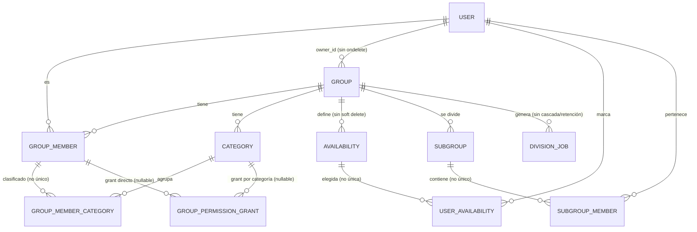

# AUDITORÍA TÉCNICA — Scheduler

> Auditoría completa (producto, UX, UI, accesibilidad, datos, backend, frontend, performance,
> seguridad, testing, SEO, observabilidad, código, escalabilidad y consistencia) + roadmap
> incremental accionable.
>
> **App:** Scheduler — coordinación de disponibilidad horaria en grupos.
> **Stack:** Flask 3 · Flask-Login · Flask-SQLAlchemy 3.1 / SQLAlchemy 2.0 · Jinja2 · Tailwind v4 ·
> Google OAuth 2.0 · PostgreSQL (psycopg2) · gunicorn · Docker · Render.
> **Fecha del relevamiento:** 2026-08-09 · **Rama:** `main` · commit base `0fee881`.
> **Última actualización de estado:** 2026-08-13 sobre `d974d57` — ver §3.5 (resueltos), §3.6 (deuda
> nueva) y §3.7 (funcionalidad entregada).

---

## Método, alcance y limitaciones

- **Técnica:** análisis estático de todo el código (`app/`, `config.py`, `run.py`), templates,
  JS, config de deploy (`Dockerfile`, `docker-compose.yml`, `render.yaml`, `render-build.sh`) e
  historia de git. Los hallazgos P0/P1 se verificaron **leyendo la fuente directamente**.
- **No ejecutado:** las dependencias de Python no están instaladas en el entorno de auditoría, así
  que no hubo introspección de la BD en runtime ni ejecución de flujos. Los nombres de tabla no
  declarados explícitamente son derivados por convención de Flask-SQLAlchemy.
- **Sin acceso a producción:** no tengo el dashboard de Render. Las variables de entorno reales de
  prod (`SECRET_KEY`, `GOOGLE_CLIENT_*`, `URL`) quedan como **Requiere investigación**; el defecto
  a nivel de código está confirmado igual.
- **Etiquetas de estado:** cada hallazgo es **Confirmado** (observado en código), **Probable**
  (efecto muy verosímil pero depende de runtime/deploy) o **Requiere investigación**.
- No se inventaron problemas: todo hallazgo trae evidencia `archivo:línea`.

---

# 1. Executive Summary

Scheduler es una app Flask server-rendered, pequeña y coherente en su dominio (grupos →
disponibilidad semanal → subgrupos), con varias decisiones de ingeniería por encima del promedio
para un proyecto de este tamaño: borrado lógico global bien implementado, remapeo de respuestas al
cambiar la grilla horaria, un panel de permisos de tercer nivel, y una pantalla de disponibilidad
(la mejor del producto) con autosave, drag-to-paint y doble render responsive.

Pero el producto tiene **dos agujeros de seguridad críticos** y una **base de integridad de datos
frágil** que ya demostró morder (la historia de commits registra un fix de constraint único, una
fuga de emails y un hueco de permisos, todos el mismo día). No hay tests, no hay CI, no hay logging
y no hay observabilidad: hoy es imposible saber si algo se rompió en producción.

**Fortalezas principales**
- Borrado lógico global con papelera/restore y filtro automático (`app/soft_delete.py`).
- Migración de grilla horaria (horas→minutos) con backfill y remapeo de respuestas.
- Flujo de disponibilidad con autosave debounced, `aria-live`, y versión mobile/desktop separada.
- Modelo de permisos con retículo de implicación limpio (`app/permissions.py`).
- Autorización mayormente correcta por objeto (subgrupos, categorías, roles) — las excepciones se
  detallan, pero el patrón general de scoping está bien.

**Problemas principales**
- **SEC-001 (P0):** cualquier miembro escala a `edit_all` sobre subgrupos auto-asignándose una categoría.
- **SEC-002 (P0):** cero protección CSRF en toda la app + 3 endpoints GET que mutan estado.
- **DATA-001/002 (P1):** faltan 6 unique constraints y todos los índices de FK; el patrón de race
  check-then-insert ya causó bugs reales.
- **BE-001 (P1):** el optimizador de subgrupos calcula compatibilidad con datos de otros grupos → salida silenciosamente incorrecta.
- **QA-001 (P1):** 0 tests, 0 CI, y el README afirma tests que no existen.
- **BE-002/OBS (P1):** 0 logging + 11 `except Exception` que devuelven `str(e)` al cliente.

**Riesgos principales**
- Escalada de privilegios y CSRF son explotables por cualquier usuario autenticado / cualquier sitio web.
- Sin constraints, la corrupción de datos (duplicados, estados imposibles) es cuestión de concurrencia.
- Sin tests ni logging, cada cambio es a ciegas y cada incidente es invisible.

**Oportunidades de mayor retorno**
- Los dos P0 son de esfuerzo medio-bajo y cierran el riesgo más grande.
- Muchos quick wins de altísimo ROI: cookie flags, `SECRET_KEY`, favicon, breakpoint `xs:` roto,
  código muerto de JS, handlers de error. Horas de trabajo, impacto desproporcionado.

No asigno un score numérico global: sería inventado. La foto honesta es *"buen esqueleto de
dominio, hardening de seguridad/datos/operación pendiente, sin red de seguridad de tests"*.

---

# 2. Product / UX Assessment

**Experiencia general.** El propósito se entiende: la landing (`main/index.html`) comunica bien el
valor (crear grupo → invitar → marcar disponibilidad → ver cuándo pueden todos). El corazón del
producto —marcar y visualizar disponibilidad— está bien resuelto. El resto de los flujos funcionan
individualmente pero el producto **se siente inconsistente** (cada pantalla reinventa botones,
estados y jerarquía) y **no perdona errores** (sin páginas de error, sin contexto en el join, sin
estados de carga en el login).

**Fricciones principales**
1. **Login opaco (UX-001).** `/login` no tiene template: hace `redirect` a Google al instante. En
   redes lentas el usuario no ve nada; si `client_secret.json` falta, revienta con texto plano sin estilo.
2. **Join sin contexto (UX-003).** El invitado va directo a Google sin saber a qué grupo entra;
   además el join muta estado por GET (un prefetch del navegador puede unir al usuario solo).
3. **Errores desnudos (UX-002).** No hay 404/500 custom; un 500 con `DEBUG=True` muestra traceback.
4. **Feedback solo por flash.** Los errores de formulario aparecen arriba de la página, lejos del
   campo. Solo el nombre de categoría tiene validación inline.
5. **Acciones destructivas desparejas.** El patrón `data-confirm` (bueno) cubre borrar grupo/miembro
   pero **no** "Quitar permiso" (irreversible, sin confirmación).

**Puntos fuertes**
- Empty states con buena cobertura (sin grupos, papelera vacía, sin categorías, sin subgrupos, sin resultados de filtro).
- Undo real en flash tras borrar grupo/miembro (link de restore).
- Autosave con reintento y estado visible en disponibilidad.

**Quick wins de UX** (detallados en §11): favicon, títulos por página, página 404/500, botón de
login branded con estado de carga, contexto de grupo en el join, confirmación en "Quitar permiso".

---

# 3. Architecture Assessment

**Frontend.** Server-rendered con Jinja2 + Tailwind v4 compilado a `main.css`, JS vanilla. **Sin
componentes/macros**: 16 templates, 0 macros, ~1450 líneas de `<script>` inline además de
`main.js`/`subgroups.js`. Consecuencia: duplicación masiva (botones, iconos, lógica de filtros) y
bugs por copiar-pegar (el bug de `` anidado se arregló en `show.html` y quedó vivo
en `subgroups/index.html`). Hay código muerto de una era Bootstrap previa que aún se carga.

**Backend.** App factory (`create_app`) pero invocada en import (`app/__init__.py:54`), blueprints
por dominio, extensiones limpias. La lógica de negocio vive **en las rutas**: `group_routes.py` son
**1058 líneas** con 284 de motor de disponibilidad embebido; `subgroup_routes.py` 670. Un solo
servicio real (`SubGroupService`, 778 líneas). Autorización por helpers inline (no decorators) en
`app/authz.py` — correcta en general, con las excepciones documentadas.

**Datos.** SQLAlchemy 2.0, 11 modelos, borrado lógico global bien hecho. Pero **sin Alembic**
(usa `create_all()` + un runner DDL aditivo manual en `app/db/migrate.py`), **sin índices de FK**,
**6 unique constraints faltantes**, FKs mayormente sin `ondelete`, y `Availability.hour` como Float
(el código compensa la imprecisión a mano).

**Deploy.** Dos caminos divergentes: Docker corre el **dev server de Werkzeug** con `DEBUG` posible;
Render corre gunicorn (1 worker default, sin flags). `run.py` ejecuta `create_all()` en import → se
corre en cada boot de worker. Sin health check que toque la BD, sin logging, sin error tracking.

**Riesgos arquitectónicos principales**
- Lógica de dominio atrapada en rutas de 1000 líneas → difícil de testear y mantener (ARCH, BE-005).
- Escrituras multi-commit sin transacción → estados huérfanos (ARCH-001).
- Esquema sin constraints ni índices → integridad y performance dependen de que el código no falle.
- Divergencia dev/prod (Werkzeug vs gunicorn, MySQL-fallback vs Postgres) → "en mi máquina anda".

---

# 3.5. Estado de implementación (actualizado 2026-08-12)

Se ejecutó una primera tanda de fixes en worktrees paralelos, ya mergeada a `main`. El campo
**Estado** dentro de cada bloque sigue indicando la **confianza de la evidencia** original
(Confirmado/Probable); esta tabla es el **estado de resolución**.

| ID | Prioridad | Resolución | Commit | Nota |
|---|---|---|---|---|
| SEC-001 | P0 | ✅ Resuelto | `34e8d85` | `_can_modify_member` ya no permite auto-asignarse categorías con permiso. |
| SEC-003 | P1 | ✅ Resuelto | `a2f7544` | `SECRET_KEY` obligatoria fuera de debug (raise); declarada en `render.yaml`. |
| SEC-004 | P1 | ✅ Resuelto | `a2f7544` | `SESSION_COOKIE_SECURE`/`SAMESITE=Lax`/`HTTPONLY` en `config.py`. |
| SEC-005 | P1 | ✅ Resuelto | `a2f7544` | Endurecido flujo OAuth (`auth_routes.py`). |
| SEC-006 | P1 | ✅ Resuelto | `f029de4` | `revoke_permission` aborta si falta `subject_id` (ya no barre por `IS NULL`). |
| SEC-007 | P1 | ✅ Resuelto | `a5e3ded` | `num_groups` con cota superior. |
| BE-001 | P1 | ✅ Resuelto | `c06e4ea` | Compatibilidad filtra `Availability.group_id`; N+1 de conteo colapsado. |
| BE-002 | P1 | ✅ Resuelto | `a5e3ded` | Logging + excepciones dejan de filtrar `str(e)`. |
| BE-003 | P1 | ✅ Resuelto | `a5e3ded` | Handlers 403/404/500 con status correcto + templates. |
| ARCH-001 | P1 | ✅ Resuelto | `f029de4` | Escrituras transaccionales con `rollback()`. |
| DATA-004 | P1 | ✅ Resuelto | `f029de4` | `SubGroupMember` se cascada al remover/salir. |
| QA-001 | P1 | ✅ Resuelto | `e96f4f0` | pytest + conftest + smoke tests + CI GitHub Actions (2 tests verdes). |
| FE-001 | P1 | ✅ Resuelto | `106467f` | `` desanidado en `subgroups/index.html`. |
| FE-002 | P1 | ✅ Resuelto | `106467f` | `--breakpoint-xs` agregado en `tailwind.css`. |
| FE-003 | P1 | ✅ Resuelto | `106467f` | Código muerto de `main.js` eliminado (−418 líneas). |
| FE-005 | P2 | ✅ Resuelto | `106467f` | `saveCategoryMembers` respeta `response.ok`. |
| UX-002 | P1 | ✅ Resuelto | `a5e3ded` | Páginas 404/500 custom. |
| OPS-001 | P1 | ✅ Resuelto | `a2f7544`/base | `pool_pre_ping`/`pool_recycle` en `config.py`. |
| SEO-001 | P2 | ✅ Resuelto | `106467f` | Favicon (`favicon.svg` + link en `base.html`). |
| **SEC-002** | **P0** | ✅ Resuelto | `ec3337c` | Flask-WTF `CSRFProtect` global; token en todos los forms + `X-CSRFToken` en fetch; `join`/`restore` pasados a POST; `csrf_error.html`; `tests/test_csrf.py`. |
| Deps CVEs | P1 (seg) | ✅ Resuelto | `0e1ca37` | pyasn1→0.6.4 (6 CVE HIGH), httplib2→0.32.0 (2 CVE HIGH), idna→3.15, python-dotenv→1.2.2, pytest→9.0.3; cierra 16 alertas de Dependabot. |
| FE-004 | P1 | ✅ Resuelto | `84f3d61` | `<style>` de `new.html` sin `theme()` v3: valores literales que el navegador sí parsea. |
| SEC-008 | P1 | ✅ Resuelto | `5c965da` | `innerHTML` con datos de usuario escapado (`show.html`, `members.html`, `subgroups.js`, `main.js`). |
| DEPLOY-001 | P1 | ✅ Resuelto | `02fefbd` | Docker sirve con `gunicorn --workers 1 --threads 4 --access-logfile -` (misma invocación que `render.yaml`); `DEBUG` default `False`. |
| DEPLOY-002 | P2 | 🟡 Parcial | `02fefbd`/`a2f7544` | Flags de gunicorn (`workers/threads/access-logfile`) + `ProxyFix` (`app/__init__.py:47`) ya están; falta `--forwarded-allow-ips`. |
| Deps/toolchain | — | ✅ Resuelto | `bcfd049`…`00d7903` | Higiene de dependencias fuera del catálogo de hallazgos: Flask duplicado eliminado, `tar` fuera, tailwind 4.3.3, `PYTHON_VERSION` 3.12.11, imagen base `python:3.12.11-slim`, Node 22 LTS. |
| UX-001 | P1 | ✅ Resuelto | `ee60738` | Pantalla de login estilada + `auth/error.html` para fallos de OAuth; `tests/test_auth_ux.py`. |
| UX-003 | P1 | ✅ Resuelto | `50147bc` | El link de invitación muestra contexto del grupo también a anónimos. |
| UX-005 | P2 | ✅ Resuelto | `515fe2b` | El cambio de rol exige confirmar con botón (se fue el `onchange` submit). |
| A11Y-001 | P1 | ✅ Resuelto | `73f35ac` | Nombre accesible en los toggles de la grilla de disponibilidad. |
| A11Y-002 | P1 | ✅ Resuelto | `5ffb0b0` | `focus-visible` en los rings + menú de usuario operable por teclado. |
| PERF-001 | P1 | ✅ Resuelto | `6a32c21`, `b6d360b`, `de886ac`, `4ec1b0d` | Eager loading + agregados únicos en rutas calientes, `defer` en los `<script>`, cache-busting del CSS, `tests/bench_queries.py` + `tests/test_query_counts.py` como regresión. Paginación sigue sin existir: se difiere hasta que algún listado crezca. |
| DATA-009 | P2 | ✅ Resuelto | `a3fcc97` | Alembic adoptado sobre el esquema existente (`alembic.ini`, `alembic/`). |
| DATA-001 | P1 | ✅ Resuelto | `3b6a8c4` | Unique parciales (`WHERE deleted_at IS NULL`) en las 6 relaciones; `tests/test_data_constraints.py`. |
| DATA-002 | P1 | ✅ Resuelto | `af436e4` | Índices compuestos `(fk, deleted_at)` en las FKs filtradas. |
| DATA-003 | P2 | ✅ Resuelto | `baacee1`, `bdc549d` | Cascada, retención y revalidación de `DivisionJob`; lista de tablas soft-delete del runner heredado congelada; `tests/test_division_jobs.py`. |
| A11Y-003 | P2 | ✅ Resuelto | `286a84b` | Un `<h1>` por página y jerarquía de headings sin saltos. |
| A11Y-004 | P2 | ✅ Resuelto | `09a3164` | `scope` en los `<th>` de las grillas. |
| SEO-002 | P2 | ✅ Resuelto | `c2e0795` | Open Graph + canonical en `base.html`, landing e invitación. |
| SEO-003 | P3 | ✅ Resuelto | `5ba89f5` | Título propio por página en las 5 vistas que compartían el genérico. |
| UX-004 | P2 | ✅ Resuelto | `852c719` | `novalidate` fuera: `required/minlength/maxlength` vuelven a validar en cliente. |
| DATA-006 | P2 | ✅ Resuelto | `fcb2941` | `ondelete` explícito en las FKs que no lo tenían; `tests/test_fk_ondelete.py`. |
| DATA-007 | P2 | ✅ Resuelto | `5ac695a` | `CHECK` de sujeto único (XOR) en `GroupPermissionGrant`; `tests/test_permission_grant_subject.py`. |
| DATA-008 | P2 | ✅ Resuelto | `954dc36` | Timestamps en el dominio + bitácora de acciones sensibles; `tests/test_audit_log.py`. |
| DATA-005 | P2 | ✅ Resuelto | `05b4054` | `availability.hour` Float → `start_minutes` entero; se fueron las compensaciones de redondeo; `tests/test_availability_minutes.py`. |
| BE-004 | P2 | ✅ Resuelto | `0475a45` | Largo de los nombres validado antes del INSERT (no más `DataError` → 500); `tests/test_input_validation.py`. |
| ARCH-002 | P2 | ✅ Resuelto | `2e86d51` | Construir la app deja de ser efecto de import; el DDL de arranque pasa por Alembic (`app/db/migrate.py` → `command.upgrade(head)`); `tests/test_app_bootstrap.py`. |
| OBS-002 | P2 | ✅ Resuelto | `b3d7b5c` | `/health` verifica la BD y el compose apunta ahí; `tests/test_health.py`. |
| DEPLOY-002 | P2 | ✅ Resuelto | `635d061` | `--forwarded-allow-ips=*` en `Dockerfile` y `render.yaml` (cierra el parcial). |
| BE-005 | P2 | ✅ Resuelto | `cc30630`, `729ad09` | Motor de disponibilidad extraído a `app/services/availability_service.py` (314 líneas); `tests/test_availability_service.py`. |
| UI-001 | P2 | ✅ Resuelto | `994c82b` | Macros Jinja (`partials/ui.html`, 9.8 KB: button/card/field/icon) adoptadas por 19 templates. |
| UI-002 | P2 | ✅ Resuelto | `994c82b` | Tema aplicado por script bloqueante en el `<head>` (`base.html:32-39`), antes del primer paint. |
| UI-003 | P3 | ✅ Resuelto | `c0992b9` | Clases muertas y restos de Bootstrap eliminados. |
| UI-004 | P3 | ✅ Resuelto | `dbfacef` | Un solo `setDarkMode` para desktop y mobile. |
| FE-006 | P2 | ✅ Resuelto | `d21c7cf` | JS muerto del modal de bulk assign borrado. |
| PERF-003 | P2 | ✅ Resuelto | `1b91ca6` | El embed de `groups.show` solo lleva las claves que el JS lee; `tests/test_embed_payload.py` + `tests/bench_payload.py` congelan el contrato. |
| SEC-009 | P2 | ✅ Resuelto | `5d142e7` | `join_token` de 256 bits, rotación por el owner y rate limit; `tests/test_join_token.py`. |
| Headers de seguridad | P2 | ✅ Resuelto | `6f7f44c` | CSP por nonce + `nosniff`, `Referrer-Policy`, `X-Frame-Options`, HSTS solo sobre HTTPS real (`app/__init__.py:120-140`); `tests/test_security_headers.py`. |
| SEC-010 | Investigar | ✅ Resuelto | — | Confirmado en Render: `client_secret.json` entregado como Secret File y secret rotado (acción humana, 2026-08-13). |

**Resumen (actualizado 2026-08-13, base `d974d57`):** 54 hallazgos resueltos — los **2 P0**, **todos
los P1** y **todo el catálogo P2/P3 original**. Cerradas las fases 1 a 10 del roadmap (§13). Del
catálogo de §4/§4.x/§12 solo queda SEC-010, que no es código.

Lo que sigue abierto no viene del catálogo original: es **deuda nueva, introducida por esta misma
tanda de cambios**. Va en §3.6. La funcionalidad de §3.7 está entregada.

---

# 3.6. Deuda posterior a la remediación (detectada 2026-08-12, actualizada 2026-08-13)

Hallazgos verificados contra `main` en `f7dd4bc`, después de mergear los 6 PRs. Ninguno estaba en el
catálogo original: son consecuencia de los propios fixes o del merge entre ramas paralelas.
QA-002, UI-005 y BE-006 ya están cerrados; FE-007, DATA-010, BE-007 y SEC-011 siguen abiertos.

| ID | Prioridad | Resolución | Commit | Nota |
|---|---|---|---|---|
| QA-002 | P0 operativo | ✅ Resuelto | `4312f64` | Regex aflojada a `id="embed-data"[^>]*>` en `test_embed_payload.py` y `bench_payload.py`; PR #27 mergeado; CI verde. |
| UI-005 | P2 | ✅ Resuelto | `eee8a0d` | Botón CSV bajo ``; `tests/test_csv_button_guard.py`. |
| BE-006 | P2 | ✅ Resuelto | `3d362a5` + `1263247` | `datetime.utcnow()` → `now(timezone.utc).replace(tzinfo=None)` en 19 sitios; `Query.get()` → `session.get()` en 4; `filterwarnings=error` en `pytest.ini` como guardrail. |
| FE-007 | P1 | 🔴 Abierto | — | JS inline sigue en ~1280 líneas entre `show.html` (~590) y `members.html` (~692). No movido a archivos estáticos; CSP necesita nonce por bloque inline. |
| DATA-010 | P2 | ✅ Resuelto | — | `app/db/migrate.py` eliminado el runner pre-Alembic (~150 líneas): `_adopt_alembic`, `_run_column_migrations`, `_run_drop_migrations`, `_ensure_deleted_at_index`, `COLUMN_MIGRATIONS`, `DROP_COLUMN_MIGRATIONS`. `migrate_database()` queda limpio: `create_all`+stamp para bases vacías, `upgrade("head")` para el resto. |
| BE-007 | P2 | 🔴 Abierto | — | `group_routes.py` 1077 líneas, `subgroup_routes.py` 782, `subgroup_service.py` 801; lógica de dominio sigue en rutas. |
| SEC-011 | P2 (decisión) | 🔴 Abierto | — | `groups.show` embebe email de todos los miembros sin guard. Decisión pendiente: email visible-para-miembro o no (afecta también `members.html` y `export_members_csv`). |

## QA-002 — `main` en rojo por un conflicto semántico entre dos PRs

**Prioridad:** P0 operativo · **Estado:** ✅ Resuelto · **Commit:** `4312f64`

### Problema
`audit-view-cleanup` (PERF-003) agregó `tests/test_embed_payload.py`, que busca el payload con la
regex `<script type="application/json" id="embed-data">`. `audit-hardening` agregó CSP por nonce, y
ahora el tag se renderiza como `<script type="application/json" id="embed-data" nonce="…">`. Cada PR
pasó CI por separado; la combinación no. Es el modo de falla típico de ramas paralelas: git mergea
sin conflicto, la semántica no.

### Resolución
Regex aflojada a `id="embed-data"[^>]*>` en `tests/test_embed_payload.py` y `tests/bench_payload.py`;
PR #27 (`fix/test-embed-nonce`) mergeado a `main`. CI verde.

---

## FE-007 — El JS inline creció: 1307 líneas en dos templates

**Prioridad:** P1 · **Estado:** Confirmado · **Impacto:** Medio-Alto · **Esfuerzo:** Alto

### Problema
§3 de esta auditoría contaba ~1450 líneas de `<script>` inline como problema estructural. Hoy
`show.html` tiene 600 y `members.html` 707 — 1307 entre dos archivos — mientras el JS servido como
estático son 1061 (`main.js` 236 + `subgroups.js` 825). UI-001 unificó el HTML con macros pero no
tocó el JS, y PERF-003/SEC-008 le sumaron lógica de parseo y escape.

### Por qué importa
- Ese JS no se cachea, no se lintea, no se testea y viaja en cada page view.
- Es la razón por la que la CSP necesita `nonce` por request en vez de poder prohibir inline: cada
  bloque inline es una excepción que hay que autorizar.
- La duplicación entre `show.html` y `members.html` (filtros, escape, render de miembros) es la misma
  que produjo FE-001 en su momento.

### Recomendación
Mover el script de cada vista a `app/static/js/<vista>.js`, consumiendo el `#embed-data` que ya
existe (el patrón ya está en las dos vistas). Empezar por `members.html`, que es el más grande y el
que más duplica con `show.html`. Al terminar, la CSP puede apretarse a `script-src 'self'` salvo el
bloque de tema.

### Criterios de aceptación
- [ ] `show.html` y `members.html` sin lógica inline más allá de leer `#embed-data`.
- [ ] El JS extraído pasa por el lint del CI.
- [ ] Los tests de embed y de headers siguen verdes.

---

## BE-006 — 5159 warnings por API deprecada

**Prioridad:** P2 · **Estado:** ✅ Resuelto · **Commits:** `3d362a5` + `1263247`

`datetime.utcnow()` reemplazado por `datetime.now(timezone.utc).replace(tzinfo=None)` en 19 sitios
(modelos, Alembic, tests). `Query.get()` reemplazado por `session.get()` en 4 sitios.
`filterwarnings=error` activado en `pytest.ini` para que cualquier warning futuro rompa CI.

---

## UI-005 — Acción visible que termina en 403

**Prioridad:** P2 · **Estado:** ✅ Resuelto · **Commit:** `eee8a0d`

Botón "Descargar CSV" envuelto en `` (variable ya disponible en el contexto del
template). `tests/test_csv_button_guard.py` verifica visibilidad por rol.

---

## DATA-010 — El runner heredado sigue cargando la mochila pre-Alembic

**Prioridad:** P2 · **Estado:** Confirmado · **Esfuerzo:** Bajo · **Riesgo:** Medio

`app/db/migrate.py` hoy hace lo correcto en el camino feliz (`command.upgrade(…, "head")`), pero
arrastra `_adopt_alembic`, `_run_column_migrations`, `_ensure_deleted_at_index` y `create_all()`
(`:104-234`): código que solo corre contra una base que nunca vio Alembic. Mientras exista, hay dos
definiciones del esquema y `create_all()` sigue siendo alcanzable en producción.
**Precaución:** no borrarlo hasta confirmar que la base de prod ya quedó *stamped* en `head` — si se
borra antes, un deploy sobre una base vieja no tiene con qué adoptar. Verificar contra Render primero.

---

## SEC-011 — Los emails de todos los miembros van embebidos en `groups.show`

**Prioridad:** P2 (decisión de producto, no bug claro) · **Estado:** Confirmado

`show.html:347-355` arma `members_data` con `email` de cada miembro **sin** consultar `can_manage`, y
lo serializa al `#embed-data` que cualquier miembro lee en el fuente. No lo llamo P1 porque
`members.html` ya muestra los emails de todo el grupo a cualquier miembro (`:158`): la exposición ya
existe en la UI y es coherente. Pero contradice el criterio de `76a96b5` ("no exponer emails del
grupo con permiso solo de subgrupos") y el de `export_members_csv`, que sí es admin-only.
**Decisión pendiente, no cambio pendiente:** o el email del grupo es visible para todo miembro (y
entonces el CSV admin-only sobra), o no lo es (y hay que filtrarlo en las tres vistas). Elegir una.

---

# 3.7. FEAT-001 — Ver los horarios del grupo con permiso de visualización

**Categoría:** Producto / Autorización · **Prioridad:** P1 ·
**Estado:** ✅ Entregado · **Commits principales:** varios + refinado en `d974d57`

### Qué se implementó
Permiso `availability.view_all` (`PERM_VIEW_AVAILABILITY`) independiente del retículo de subgrupos.
Un miembro con ese permiso ve la grilla agregada del grupo; sin él, solo sus propias marcas.

### Implementación entregada
- `app/permissions.py:17`: `PERM_VIEW_AVAILABILITY = "availability.view_all"` independiente del retículo de subgrupos.
- `LEVELS` (`:42`): entrada "Ver los horarios del grupo" concedible por miembro/categoría desde `permissions.html`.
- `group_routes.py:193`: `can_view_group_availability = PERM_VIEW_AVAILABILITY in perms`; owner/admin reciben el permiso vía `ALL_PERMISSIONS` (sin shortcircuit redundante — limpiado en `d974d57`).
- `show.html`: grilla agregada y conteos bajo `can_view_availability` del `#embed-data`.
- `tests/test_availability_view_permission.py`: los tres casos (sin permiso, con permiso, owner).

### Estado de criterios
- [x] Sin permiso → solo marcas propias.
- [x] Con permiso → grilla agregada + conteos.
- [x] Concedible por miembro y categoría desde el panel del owner.
- [x] `subgroups.view_all` **no** implica `availability.view_all`.
- [x] Embed no lleva `cell_users` a quien no tiene el permiso.
- [x] Tests verdes (3 casos).

---

---

# 4. Detailed Findings

> Los hallazgos P0 y P1 llevan el bloque completo. Los P2/P3 van condensados en §4.x y en el backlog (§12).
> Impacto/Esfuerzo/Riesgo se estiman Alto/Medio/Bajo. "Riesgo" = riesgo de *implementar* el cambio.

---

## SEC-001 — Escalada de privilegios por auto-asignación de categoría
**Categoría:** Security / Authorization
**Prioridad:** P0 · **Estado:** Confirmado · **Impacto:** Alto · **Esfuerzo:** Bajo · **Riesgo:** Bajo

### Problema
Un miembro común de un grupo puede otorgarse a sí mismo permisos de subgrupos (hasta `edit_all`)
asignándose una categoría que el owner haya asociado a un nivel de permiso.

### Evidencia
`app/routes/category_routes.py:126-127`:
```python
def _can_modify_member(group_owner_id, acting_role_name, gm_user_id):
    return (group_owner_id == current_user.id) or (acting_role_name == "ADMIN") or (gm_user_id == current_user.id)
```
El tercer término permite a un miembro modificarse **a sí mismo**. `_handle_member_post`
(`:130-149`) lee `category_id` del request y **nunca valida** que la categoría pertenezca al grupo
ni que el usuario tenga derecho a esa categoría. La ruta `member_categories` (`:238`) solo exige
`require_group_member`. Luego `app/permissions.py:87-96` resuelve permisos **dinámicamente** desde
`membership.categories`:
```python
category_ids = [assoc.category_id for assoc in membership.categories]
...
grants = GroupPermissionGrant.query.filter(GroupPermissionGrant.group_id == group.id,
                                            scheduler_db.or_(*subject_filter)).all()
return expand(grant.permission for grant in grants)
```
Resultado: `POST /categories/group_member/<mi_gm_id>` con `category_id=<categoría con edit_all>` →
el miembro queda con `edit_all` en el siguiente request.

### Por qué importa
Rompe todo el modelo de autoridad de subgrupos: cualquier miembro puede editar/crear/borrar
subgrupos, ver todos los emails (vía `subgroups.new`/`export`), y deshacer trabajo de otros. Es el
tipo de bug que ya lastimó a esta feature (commits `76a96b5`, `780d9df` el mismo día del release).

### Recomendación
Separar dos operaciones que hoy están fusionadas: **(a)** un miembro gestionando su propia relación
con categorías "normales" y **(b)** la asignación de categorías que **portan permisos**. Lo mínimo:
1. Validar que `category_id` pertenece a `gm.group_id` (como ya hace el path bulk en `_validate_bulk_ids:187-197`).
2. Prohibir que un no-admin/no-owner se asigne/desasigne una categoría que tenga cualquier `GroupPermissionGrant` asociado.

### Implementación
1. En `_handle_member_post` y `_handle_member_delete`, cargar la `Category` y hacer `abort(404)`/`403`
   si `category.group_id != gm.group_id`.
2. Antes de permitir a un miembro (no admin/owner) tocar la categoría, consultar si existe
   `GroupPermissionGrant.query.filter_by(group_id=gm.group_id, category_id=category_id).first()`;
   si existe, exigir `require_group_admin_or_owner`.
3. Alternativa más robusta a mediano plazo (ver §18 sobre cuándo): mover los grants por-categoría a
   una tabla que no dependa de la auto-asignación del propio miembro, o snapshotear la membresía de
   categorías con permiso. No es necesario para cerrar el bug.

### Criterios de aceptación
- [ ] Un miembro no-admin recibe 403 al asignarse una categoría con permiso asociado.
- [ ] Un miembro recibe 404/403 al asignarse una categoría de otro grupo.
- [ ] El owner/admin conserva la capacidad de asignar cualquier categoría del grupo.
- [ ] Test de regresión que reproduce la escalada y verifica el 403.

### Riesgos / efectos secundarios
Bajo. Si la UI hoy deja a miembros auto-asignarse categorías informativas, verificar que esas
categorías no tengan grants (o el 403 confundirá). Documentar el criterio.

### Dependencias
Ninguna para el fix mínimo. Idealmente después de QA-001 (para escribir el test primero).

---

## SEC-002 — Sin protección CSRF + endpoints GET que mutan estado
**Categoría:** Security
**Prioridad:** P0 · **Estado:** Confirmado · **Impacto:** Alto · **Esfuerzo:** Medio · **Riesgo:** Medio

### Problema
Ninguna de las ~26 rutas POST ni los `fetch` JSON valida un token CSRF. Además, tres rutas que
mutan estado responden a **GET**, lo que las hace disparables por un ``/prefetch.

### Evidencia
`grep -rni "csrf|flask_wtf|wtforms"` sobre `.py/.html/.js/.txt` → **0**. No hay Flask-WTF en
`requirements.txt`. Rutas GET que mutan: `groups.join` (`group_routes.py:505`), `groups.restore`
(`:812`), `groups.restore_member` (`:882`). Ejemplos de POST sin token: borrar grupo
(`show.html:36`), cambiar rol (`members.html:191`), conceder/quitar permiso (`permissions.html`),
borrar subgrupo. Endpoints `fetch` sin token: `/availability/autosave`, `/categories/bulk_assign`.

### Por qué importa
Cualquier sitio web que un usuario logueado visite puede: borrar sus grupos, cambiar roles,
sacar miembros, conceder/revocar permisos, o unirlo a un grupo — sin su intención. Con
`SESSION_COOKIE_SAMESITE` sin setear (SEC-004), no hay ni siquiera la defensa parcial del navegador.

### Recomendación
Añadir CSRF con `Flask-WTF` (`CSRFProtect`) — global para forms, header `X-CSRFToken` para `fetch`.
Y convertir los 3 GET mutantes en POST.

### Implementación
1. `pip install Flask-WTF`; en el factory: `from flask_wtf import CSRFProtect; CSRFProtect(app)`.
2. En cada `<form method="POST">` agregar `{{ csrf_token() }}` (un hidden). Como no hay macros, es
   mecánico; considerar un `` de una línea para no repetir.
3. Exponer el token a JS (meta tag en `base.html`) y enviarlo en `fetch` como header
   `X-CSRFToken`; configurar `WTF_CSRF_HEADERS`.
4. Cambiar `join/restore/restore_member` a `methods=["POST"]` y actualizar los templates (los links
   de restore en flash pasan a mini-forms). El join por link puede quedar como GET que **muestra**
   una página de confirmación ("¿Unirte al grupo X?") y un POST que efectúa la unión (resuelve
   también UX-003).

### Criterios de aceptación
- [ ] Un POST sin token válido devuelve 400 y no muta nada.
- [ ] Todos los forms y `fetch` mutantes incluyen y validan el token.
- [ ] `join/restore/restore_member` ya no mutan por GET.
- [ ] Test que verifica el rechazo sin token en al menos delete-group y update-role.

### Riesgos / efectos secundarios
Medio: si se olvida un form o un `fetch`, ese flujo se rompe (400). Hacer un barrido exhaustivo de
los 26 forms + 16 `fetch`. El cambio GET→POST del join afecta links ya compartidos: mantener el GET
como página de confirmación evita romperlos.

### Dependencias
SEC-004 (SameSite) es complementario. Idealmente QA-001 antes, para tests.

---

## SEC-003 — `SECRET_KEY` con default aleatorio por proceso
**Categoría:** Security / Config
**Prioridad:** P1 · **Estado:** Confirmado (código) / dashboard Requiere investigación · **Impacto:** Alto · **Esfuerzo:** Bajo · **Riesgo:** Bajo

### Problema
`config.py:25`: `SECRET_KEY = os.getenv("SECRET_KEY", os.urandom(24))`. Si la env var no está
seteada, cada proceso genera una clave distinta. `render.yaml:14-18` solo declara `DATABASE_URL`.

### Por qué importa
Con gunicorn multi-worker (o cualquier restart/deploy), las sesiones firmadas con una clave dejan de
validar en otra → los usuarios se deslogean de forma aparentemente aleatoria y pierden sesión en
cada deploy. Si algún día se sube a >1 worker (recomendado), el bug se vuelve permanente.

### Recomendación
Nunca defaultear a aleatorio en server-rendered con sesiones. Fallar ruidoso si falta en prod.

### Implementación
1. Declarar `SECRET_KEY` en `render.yaml` (`generateValue: true` de Render, que la persiste).
2. En `config.py`, en modo no-debug, `raise RuntimeError` si `SECRET_KEY` no está en env (en vez de
   `os.urandom`). En dev, permitir un default fijo.

### Criterios de aceptación
- [ ] Arrancar sin `SECRET_KEY` en modo prod falla con mensaje claro.
- [ ] Las sesiones sobreviven a un restart de la app en Render.
- [ ] `render.yaml` declara `SECRET_KEY`.

### Riesgos / efectos secundarios
Bajo. Verificar primero si ya está seteada en el dashboard de Render (Requiere investigación) para
no sorprenderte con un fallo de arranque.

### Dependencias
Ninguna.

---

## SEC-004 — Cookie de sesión sin `Secure`/`SameSite`
**Categoría:** Security / Config
**Prioridad:** P1 · **Estado:** Confirmado · **Impacto:** Medio-Alto · **Esfuerzo:** Bajo · **Riesgo:** Bajo

### Problema
`config.py` no setea `SESSION_COOKIE_SECURE`, `SESSION_COOKIE_SAMESITE`. Default de Flask: `Secure=False`, `SameSite=None`.

### Por qué importa
La cookie de sesión viaja por HTTP plano (interceptable) y no tiene la defensa parcial de SameSite
contra CSRF. Combinado con SEC-002, la superficie CSRF es total.

### Recomendación / Implementación
En `config.py` (prod): `SESSION_COOKIE_SECURE = True`, `SESSION_COOKIE_SAMESITE = "Lax"`,
`SESSION_COOKIE_HTTPONLY = True` (explícito). Con Render detrás de HTTPS, `Secure=True` es correcto;
para que Flask confíe en el proxy, gunicorn con `--forwarded-allow-ips` + `ProxyFix`.

### Criterios de aceptación
- [ ] La cookie de sesión en prod tiene `Secure; HttpOnly; SameSite=Lax`.
- [ ] El login sigue funcionando detrás del proxy TLS de Render.

### Dependencias
DEPLOY-002 (ProxyFix / forwarded-allow-ips) para que `Secure` no rompa el login por HTTP interno.

---

## SEC-005 — Endurecimiento del flujo OAuth
**Categoría:** Security / Auth
**Prioridad:** P1 · **Estado:** Confirmado · **Impacto:** Medio · **Esfuerzo:** Bajo · **Riesgo:** Bajo

### Problema
Tres debilidades en `app/routes/auth_routes.py`:
1. `os.environ["OAUTHLIB_INSECURE_TRANSPORT"] = "1"` (`:25`) seteado **en cada `/login`**,
   permanente y a nivel de todo el proceso → desactiva la exigencia de HTTPS de oauthlib.
2. El `state` se valida **después** de `flow.fetch_token(...)` (`:60` vs `:62`) y por acceso crudo
   `session["state"] != request.args["state"]` → `KeyError` → 500 si falta cualquiera.
3. No se chequea `id_info["email_verified"]` ni se restringe el dominio (`hd`).

### Por qué importa
(1) es una mala práctica que, si algún día el proceso ve HTTP interno, degrada silenciosamente la
seguridad del intercambio. (2) hace el login frágil (500 en vez de "sesión expirada, reintenta") y
mueve la validación anti-CSRF de OAuth después de gastar el code. (3) confía el email como identidad
sin verificar el claim (bajo riesgo con Google, pero es el sello de identidad de toda la app).

### Recomendación / Implementación
1. Eliminar el `os.environ[...INSECURE_TRANSPORT...]` y asegurar `redirect_uri` HTTPS en prod
   (`Config.URL` con `https://`). Solo activarlo en dev vía env explícita.
2. Construir el `Flow` con `state=session["state"]` y usar `session.get("state")`; si no coincide o
   falta, redirigir a `/login` con flash "La sesión expiró, intenta de nuevo" (no 500).
3. Validar `id_info.get("email_verified") is True` antes de `get_or_create_from_oauth`.

### Criterios de aceptación
- [ ] `OAUTHLIB_INSECURE_TRANSPORT` no se setea en el código de prod.
- [ ] Un callback con state faltante/incorrecto redirige con mensaje, no 500.
- [ ] Se rechaza un id_token con `email_verified=false`.

### Dependencias
Ninguna. UX-001 (template de login/errores) es complementario.

---

## SEC-006 — `revoke_permission` borra en masa si falta `subject_id`
**Categoría:** Security / Data integrity
**Prioridad:** P1 · **Estado:** Confirmado · **Impacto:** Medio · **Esfuerzo:** Bajo · **Riesgo:** Bajo

### Problema
`app/routes/group_routes.py:1042-1052`:
```python
subject_id = request.form.get("subject_id", type=int)   # None si falta o no es entero
if subject_type == "member":
    subject_filters = {"group_member_id": subject_id}
...
grants = GroupPermissionGrant.query.filter_by(group_id=group.id, **subject_filters).all()
```
`filter_by(group_member_id=None)` compila a `IS NULL`, que matchea **todos los grants por categoría**
del grupo (y viceversa). Un submit con `subject_id` faltante/no numérico borra en masa.

### Por qué importa
Es owner-only y recuperable (soft delete), pero silencioso, sin auditoría y no intencional. Un bug
de UI o un doble-submit puede vaciar todos los permisos de un grupo.

### Recomendación / Implementación
Validar `subject_id`: si es `None`, `flash("inválido")` y volver, igual que ya hace
`set_permission_level` (`:1002-1011`). Añadir el unique/guard no aplica; es validación de input.

### Criterios de aceptación
- [ ] `revoke` sin `subject_id` no borra nada y muestra error.
- [ ] Test que verifica que un `subject_id` faltante no afecta otros grants.

### Dependencias
Ninguna.

---

## SEC-007 — `num_groups` sin cota superior (DoS)
**Categoría:** Security / Performance
**Prioridad:** P1 · **Estado:** Confirmado · **Impacto:** Medio · **Esfuerzo:** Bajo · **Riesgo:** Bajo

### Problema
`subgroup_routes.py:124-126` solo rechaza `num_groups < 1`. `subgroup_service.py:557` hace
`groups = [[] for _ in range(num_groups)]` y luego itera unidades × grupos con validación de reglas.

### Por qué importa
Un holder de `PERM_EDIT_ALL` (o, por SEC-001, cualquier miembro) manda `num_groups=5_000_000` y
consume memoria/CPU. Con 1 worker gunicorn (default de Render), bloquea toda la app.

### Recomendación / Implementación
Cota superior razonable (p.ej. `min(num_groups, len(members))` y un techo duro como 200) y `abort(400)`
si excede. Coercionar `num_groups` a int con manejo de error (hoy un string revienta con `TypeError`
tragado por el `except Exception` → 500).

### Criterios de aceptación
- [ ] `num_groups` mayor al techo o no numérico devuelve 400 con mensaje, sin alocar.

### Dependencias
Ninguna. Relacionado con BE-002 (dejar de tragar la excepción).

---

## SEC-008 — Sinks de DOM XSS vía `innerHTML`
**Categoría:** Security / Frontend
**Prioridad:** P1 · **Estado:** Confirmado · **Impacto:** Medio · **Esfuerzo:** Medio · **Riesgo:** Bajo

### Problema
Varios lugares reinyectan datos en el DOM con template literals + `innerHTML` sin escapar. El nombre
de categoría es totalmente controlado por un admin y se renderiza en las pantallas de otros miembros.

### Evidencia
`show.html:938,945` (`${m.name}`, `${m.email}`, `${c.name}`), `members.html:676-682`,
`subgroups.js:622,631`, `main.js:202-220` (`confirmAction`) y `:159-166` (`showToast`). Nota: los
diálogos nuevos de `main.js:30,65` ya usan `textContent` — el hardening quedó a medias.

### Por qué importa
Stored XSS: un admin pone `` como nombre de categoría; se ejecuta en el
navegador de cada miembro que abra el grupo. Robo de sesión, acciones en nombre del usuario.

### Recomendación / Implementación
Reemplazar `innerHTML` con `textContent` o construcción de nodos (`createElement` + `append`).
Donde se necesite estructura, escapar explícitamente. Priorizar los sinks con datos controlados por
otros (nombres de categoría/miembro). Auditar los template literals que van a `innerHTML`.

### Criterios de aceptación
- [ ] Un nombre de categoría con `<script>`/`onerror` se renderiza como texto, no ejecuta.
- [ ] No quedan `innerHTML =` con interpolación de datos de usuario en los archivos citados.

### Dependencias
Idealmente después de UI-001 (si se extraen componentes JS reutilizables, se escapa una sola vez).

---

## BE-001 — El optimizador de subgrupos usa disponibilidad de otros grupos
**Categoría:** Backend / Correctness
**Prioridad:** P1 · **Estado:** Confirmado · **Impacto:** Alto · **Esfuerzo:** Bajo · **Riesgo:** Medio

### Problema
`SubGroupService` calcula compatibilidad cargando `UserAvailability` **sin filtrar por grupo**, con
una slot key global.

### Evidencia
`subgroup_service.py:82-84`:
```python
availabilities = UserAvailability.query.filter(UserAvailability.user_id.in_(user_ids)).all()
```
y la key `slot_id = f"{weekday}_{hour}"` (`:90`) — sin `group_id`. También `:55-57`
(`availability_count`, usado para ordenar). Dos grupos con un lunes-09:00 colapsan en el mismo slot.

### Por qué importa
La feature central de subgrupos (dividir por compatibilidad horaria) produce resultados
**silenciosamente incorrectos** para cualquier usuario que pertenezca a más de un grupo. No hay
error, no hay señal: los subgrupos simplemente están mal armados. El README promete "~85-95% de
cumplimiento" sin ningún test que lo respalde.

### Recomendación / Implementación
Filtrar por grupo: hacer join a `Availability` y filtrar `Availability.group_id == parent_group_id`
(el CSV export ya lo hace bien en `group_routes.py:600-607`). Incluir `group_id` en la slot key es
innecesario si ya se filtró. Repetir en `:55-57`.

### Criterios de aceptación
- [ ] La matriz de compatibilidad solo considera marcas del grupo en cuestión.
- [ ] Test: un usuario con disponibilidad en dos grupos produce compatibilidad idéntica a si solo
      estuviera en uno.

### Riesgos / efectos secundarios
Medio: cambia el resultado del optimizador (a mejor). Si hay `SubGroup.meta`/`DivisionJob` viejos con
snapshots, quedan obsoletos (ya lo están; ver DATA-003/005).

### Dependencias
QA-001 (test primero, dado que es un cambio de correctitud sin red de seguridad).

---

## BE-002 — Excepciones tragadas que filtran internals + cero logging
**Categoría:** Backend / Observability / Security
**Prioridad:** P1 · **Estado:** Confirmado · **Impacto:** Alto · **Esfuerzo:** Medio · **Riesgo:** Bajo

### Problema
11 bloques `except Exception as e` devuelven `str(e)` al cliente (flash o JSON), y **no hay logging
en toda la app**. Además, `HTTPException` (que `abort()` lanza) hereda de `Exception`, así que estos
`except` **se tragan los `abort(403)/404`** y los convierten en 500 o en flashes engañosos.

### Evidencia
`subgroup_routes.py:159,237,239,292,294,390,392,496,521,542,582,614,668` etc.; ejemplo:
`return jsonify({'error': f'Error al generar subgrupos: {str(e)}'}), 500`. `subgroup_routes.py:390`
atrapa el `abort(403)` de `:316` y lo muestra como `flash("Error al exportar: 403 Forbidden: ...")`.
`grep -rn "logging|logger" app/` → **0**.

### Por qué importa
- **Fuga de internals:** mensajes crudos de SQLAlchemy/psycopg2 (nombres de tabla, SQL, constraints)
  llegan al usuario.
- **Invisibilidad operacional:** ningún error queda registrado. Un operador no tiene forma de saber
  que algo falló, ni cuántas veces.
- **Autorización rota:** un `abort(403)` termina como 500 o como flash de "error", no como denegación.

### Recomendación / Implementación
1. Configurar `logging` (handler a stdout, nivel por env) en el factory; loguear excepciones con
   `app.logger.exception(...)`.
2. Estrechar los `except Exception` a las excepciones que de verdad se esperan (p.ej.
   `SQLAlchemyError`) y **re-lanzar `HTTPException`** (`except HTTPException: raise`) antes del catch genérico.
3. Devolver mensajes genéricos al cliente ("No se pudo generar la división"), loguear el detalle.

### Criterios de aceptación
- [ ] Ningún endpoint devuelve `str(exc)` crudo al cliente.
- [ ] `abort(403/404)` dentro de un try se propaga como 403/404.
- [ ] Los errores quedan en el log con stack trace.

### Dependencias
Se apoya en BE-003 (handlers de error correctos).

---

## BE-003 — Handlers 403/404 devuelven redirect sin status → rompen los endpoints JSON
**Categoría:** Backend / API
**Prioridad:** P1 · **Estado:** Confirmado · **Impacto:** Medio-Alto · **Esfuerzo:** Bajo · **Riesgo:** Bajo

### Problema
`app/__init__.py:27-42` maneja 403 y 404 devolviendo `redirect(...)` **sin código de status** → el
cliente recibe **302**, no 403/404. No hay handler 500.

### Por qué importa
Los endpoints `fetch` que esperan JSON (p.ej. `bulk_assign` haciendo `abort(403)`) reciben un 302 a
HTML → `response.json()` explota en el cliente y el usuario ve un error genérico o nada. Además la
semántica HTTP es incorrecta para cualquier consumidor.

### Recomendación / Implementación
Distinguir por tipo de request: si `request.accept_mimetypes` prefiere JSON o la ruta es de API,
devolver `jsonify({...}), 403/404`; si es navegación, redirigir con flash **y** el status correcto.
Añadir handler 500 (renderiza `500.html`, loguea). Ver UX-002 para los templates.

### Criterios de aceptación
- [ ] Un `fetch` a un endpoint denegado recibe 403 con cuerpo JSON, no 302.
- [ ] Una navegación denegada recibe una página con status correcto.
- [ ] Existe handler 500 que loguea y muestra `500.html`.

### Dependencias
UX-002 (templates 404/500), BE-002 (logging).

---

## ARCH-001 — Escrituras multi-commit sin transacción → estados huérfanos
**Categoría:** Architecture / Data integrity
**Prioridad:** P1 · **Estado:** Confirmado · **Impacto:** Alto · **Esfuerzo:** Medio · **Riesgo:** Medio

### Problema
Varias operaciones hacen dos o más `commit()` separados sin límite transaccional; un fallo entre
ellos deja datos inconsistentes. `group_routes`/`category_routes` no tienen ningún `rollback()`.

### Evidencia
- `group_routes.py:490-495`: `create()` commitea el `Group` y luego, por separado, el `GroupMember`
  del owner. Fallo en medio → grupo cuyo owner **no es miembro** → `require_group_member` lo deja
  afuera de su propio grupo, y no puede borrarlo ni restaurarlo (huérfano permanente).
- `group_routes.py:631-634` y `:691-694`: la disponibilidad se **borra** (commit) y luego se
  **reinserta** (commit). Fallo en medio → respuestas del usuario perdidas.
- `group_routes.py:749-759`: settings de grilla y remapeo en commits separados.

### Por qué importa
Pérdida de datos y estados imposibles bajo cualquier fallo (timeout de BD, deploy, excepción). Sin
constraints (DATA-001) que atajen, la única barrera es que el código no falle nunca.

### Recomendación / Implementación
Envolver cada operación lógica en **una** transacción: construir todos los objetos, un solo
`commit()`, `rollback()` en `except`. En SQLAlchemy 2.0/Flask-SQLAlchemy, `with scheduler_db.session.begin():`
o simplemente agrupar los `add` y commitear una vez al final.

### Criterios de aceptación
- [ ] `create()` deja grupo + membership del owner en una transacción (o ninguno).
- [ ] Un fallo simulado en el guardado de disponibilidad no borra las respuestas previas.
- [ ] Los flujos afectados tienen `rollback()` en error.

### Riesgos / efectos secundarios
Medio: reordenar commits puede exponer supuestos ocultos (p.ej. depender de un id autogenerado
antes del segundo insert). Testear cada flujo tocado.

### Dependencias
DATA-001 (constraints) es complementario. QA-001 para tests.

---

## DATA-001 — Faltan 6 unique constraints (tablas como bags, races)
**Categoría:** Data
**Prioridad:** P1 · **Estado:** Confirmado · **Impacto:** Alto · **Esfuerzo:** Medio · **Riesgo:** Medio

### Problema
Seis relaciones se protegen solo con "chequear-y-después-insertar" en código, sin constraint de BD.
Bajo concurrencia (dos requests), ambos pasan el chequeo e insertan duplicados.

### Evidencia
| Tabla | Debería ser único | Guardado solo en código |
|---|---|---|
| `group_member` | `(group_id, user_id)` | `group_routes.py:516` (join); `create`/seed insertan sin guard |
| `user_availability` | `(user_id, availability_id)` | `group_routes.py:119-121` |
| `availability` | `(group_id, weekday, hour)` | `group_routes.py:83-92` |
| `group_member_category` | `(group_member_id, category_id)` | `category_routes.py:139,212` |
| `subgroup_members` | `(subgroup_id, user_id)` | `subgroup_routes.py:565-571`; **`confirm:212-217` inserta sin guard** |
| `category` | `(group_id, lower(name))` | `category_routes.py:33-39` |

El caso de grants ya se arregló con `uq_perm_grant_subject` (commit `0fee881`) — prueba de que el
patrón muerde en la práctica.

### Por qué importa
Membresías duplicadas inflan conteos ("pueden todos" se calcula sobre responders), disponibilidad
duplicada distorsiona el optimizador, categorías duplicadas ensucian la UI. `subgroup_routes.confirm`
es el peor: ni siquiera usa el helper `_add_subgroup_member` que existe para evitar duplicar.

### Recomendación / Implementación
Añadir `UniqueConstraint` a cada tabla. **Precaución con el soft delete:** un unique simple choca con
filas soft-deleted que comparten la clave. Opciones: (a) unique parcial en Postgres
`UniqueConstraint(..., postgresql_where=(deleted_at.is_(None)))`; (b) incluir `deleted_at` en la
clave. Antes de aplicar, **deduplicar** los datos existentes (script que soft-deletea duplicados).
Como no hay Alembic, agregar entradas al runner `app/db/migrate.py` (`COLUMN_MIGRATIONS` no aplica a
constraints — habría que extender el runner o, mejor, adoptar Alembic; ver §18 sobre timing).

### Criterios de aceptación
- [ ] Insertar un duplicado activo en cada tabla falla a nivel de BD.
- [ ] El código maneja el `IntegrityError` con mensaje limpio (no 500 crudo).
- [ ] Los duplicados existentes se limpiaron antes de aplicar el constraint.
- [ ] `subgroup_routes.confirm` usa `_add_subgroup_member`.

### Riesgos / efectos secundarios
Medio-Alto: aplicar un unique sobre datos con duplicados **falla la migración**. Deduplicar primero,
en una fase separada (Regla 10: compatibilidad/rollback/datos existentes). Interacción con soft delete
debe resolverse con unique parcial.

### Dependencias
DATA-009 (idealmente Alembic antes de tocar constraints). BE-002 (manejar `IntegrityError`).

---

## DATA-002 — Cero índices en foreign keys (Postgres no los crea solo)
**Categoría:** Data / Performance
**Prioridad:** P1 · **Estado:** Confirmado · **Impacto:** Alto (a escala) · **Esfuerzo:** Bajo · **Riesgo:** Bajo

### Problema
Ninguna FK tiene índice. Postgres (el target real) **no** indexa FKs automáticamente (MySQL, el
fallback de dev, sí — lo cual enmascara el problema en desarrollo). Además el filtro global
`deleted_at IS NULL` (`soft_delete.py:48-54`) va en **cada** SELECT, así que los índices ideales son
compuestos `(fk, deleted_at)`.

### Evidencia
Columnas filtradas sin índice: `group_member.(group_id,user_id)`, `availability.group_id`,
`user_availability.(user_id,availability_id)`, `category.group_id`,
`group_member_category.(group_member_id,category_id)`, `group.owner_id`, `subgroups.parent_group_id`,
`division_jobs.parent_group_id`, `group_permission_grant.(group_member_id,category_id)`. Los únicos
índices existentes: `ix_*_deleted_at` (×8), `idx_subgroup_user`, `idx_perm_grant_group`, y los unique.

### Por qué importa
Hoy con pocos datos no se nota. A 10x miembros/grupos, cada listado y cada agregado hace full scans.
Combinado con N+1 (PERF-001), la degradación es multiplicativa.

### Recomendación / Implementación
Añadir índices compuestos `(fk, deleted_at)` en las columnas de la tabla de arriba. Extender el
runner de migración (o Alembic) para crearlos `IF NOT EXISTS`. Medir con `EXPLAIN` antes/después en
las queries de `groups.show` y del optimizador.

### Criterios de aceptación
- [ ] `EXPLAIN` de las queries de listado usa index scan, no seq scan, con datos de prueba.
- [ ] Los índices existen en Postgres tras el deploy.

### Dependencias
DATA-009 (mecanismo de migración). Complementa PERF-001.

---

## DATA-003 — `DivisionJob` nunca se borra y no se cascada
**Categoría:** Data
**Prioridad:** P1 · **Estado:** Confirmado · **Impacto:** Medio · **Esfuerzo:** Bajo · **Riesgo:** Bajo

### Problema
Se escribe un `DivisionJob` (con `result_json` completo: nombres y emails) en **cada** generación de
preview (`subgroup_routes.py:140-148`), nunca se borra ni soft-deletea, y no está en
`Group.soft_delete_cascade` (`group.py:38-39`).

### Por qué importa
Crecimiento no acotado (20 clicks de "Generar" = 20 filas JSON gordas). Al borrar un grupo, sus jobs
quedan huérfanos y siguen siendo alcanzables por `subgroups.export?job_id=` para quien recupere
`PERM_VIEW_ALL` → **fuga de emails de un grupo borrado**.

### Recomendación / Implementación
1. Cascada: incluir `division_jobs` en el soft-delete del grupo (o `ondelete=CASCADE` real, ya lo tiene la FK).
2. Retención: borrar/expirar jobs viejos (mantener solo el último confirmado por grupo, o TTL).
3. `export` debe re-verificar que el job pertenece a un grupo no borrado.

### Criterios de aceptación
- [ ] Borrar un grupo hace inaccesibles sus `DivisionJob`.
- [ ] Existe límite de retención de jobs por grupo.

### Dependencias
Ninguna.

---

## DATA-004 — `SubGroupMember` no se cascada al remover/salir un miembro
**Categoría:** Data
**Prioridad:** P1 · **Estado:** Confirmado · **Impacto:** Medio · **Esfuerzo:** Bajo · **Riesgo:** Bajo

### Problema
`GroupMember.soft_delete_cascade` (`group_member.py:33-36`) cascadea categorías y grants, pero **no**
`SubGroupMember`. Un miembro sacado con `safe_remove_member` o que hace `leave` sigue en todos sus
subgrupos.

### Por qué importa
Aparece en `subgroups.index`, en `export` (con su email) y cuenta en `subgroup.members` — un ex-miembro
"fantasma" en la división. Inconsistencia visible y potencial fuga.

### Recomendación / Implementación
Incluir la limpieza de `SubGroupMember` del usuario en ese grupo dentro de `safe_remove_member`/`leave`
(soft-delete de las filas correspondientes). Ojo: `SubGroupMember` no tiene `group_id`, hay que
resolver vía `subgroup.parent_group_id`.

### Criterios de aceptación
- [ ] Sacar/salir a un miembro lo remueve de los subgrupos de ese grupo.
- [ ] El export ya no lista ex-miembros.

### Dependencias
Ninguna.

---

## PERF-001 — N+1 generalizado, sin eager loading, sin paginación
**Categoría:** Performance
**Prioridad:** P1 · **Estado:** Confirmado · **Impacto:** Alto (a escala) · **Esfuerzo:** Medio · **Riesgo:** Bajo

### Problema
No hay `joinedload/selectinload` en ninguna parte, no hay `paginate/limit` en ninguna parte (49
`.all()` sin cota), y hay N+1 tanto en rutas como en templates.

### Evidencia
- `subgroup_service.load_members` (`:39-68`): ~4 queries por miembro antes de empezar.
- `export_members_csv` (`:594-614`): `.count()` dentro del loop de miembros.
- `groups.permissions` (`:940-949`): `.count()` dentro del loop de categorías.
- Templates: `groups/index.html:52,56` (`|length` sobre relaciones lazy por fila),
  `show.html:306-310` (miembros anidados en el loop de categorías → O(cat×miembros)).
- `get_availability_data` (`:294-327`): carga **todas** las marcas del grupo en cada page view.

### Por qué importa
Hoy tolerable; a 10x explota. `groups.show` sola dispara ~8 queries + lazy loads por miembro/subgrupo.

### Recomendación / Implementación
1. Eager loading en las rutas calientes: `Group.query.options(selectinload(Group.members).selectinload(GroupMember.user), selectinload(Group.categories), ...)`.
2. Reemplazar los `.count()` en loop por un `GROUP BY` único (un dict `{category_id: count}`).
3. Paginar los listados no acotados (miembros, papelera, jobs) cuando crezcan; por ahora al menos
   cota + orden estable.
4. Precalcular en la ruta lo que el template hoy recomputa con lazy loads.

### Criterios de aceptación
- [ ] `groups.show` con 100 miembros hace un número constante de queries (medido con echo/EXPLAIN).
- [ ] Los `.count()`-en-loop se eliminaron.

### Dependencias
DATA-002 (índices) potencia el efecto. Idealmente medir (Fase 0) antes de optimizar.

---

## OPS-001 — Sin `pool_pre_ping`/`pool_recycle` (desconexiones en Render)
**Categoría:** Ops / Config
**Prioridad:** P1 · **Estado:** Confirmado (código) / efecto Probable · **Impacto:** Medio-Alto · **Esfuerzo:** Bajo · **Riesgo:** Bajo

### Problema
`config.py` no define `SQLALCHEMY_ENGINE_OPTIONS` → defaults de SQLAlchemy sin `pool_pre_ping` ni
`pool_recycle`. Postgres de Render (free) corta conexiones idle agresivamente.

### Por qué importa
Tras un período idle, la primera request falla con `OperationalError: server closed the connection`
→ error 500 visible para el usuario, intermitente y difícil de diagnosticar (sin logging, OBS).

### Recomendación / Implementación
`SQLALCHEMY_ENGINE_OPTIONS = {"pool_pre_ping": True, "pool_recycle": 280}`. Verificar además que
`DATABASE_URL` no use el esquema legacy `postgres://` (SQLAlchemy 2.0 lo rechaza) — normalizar a
`postgresql://` si hace falta.

### Criterios de aceptación
- [ ] Tras 30 min idle, la primera request funciona sin 500.

### Dependencias
Ninguna.

---

## DEPLOY-001 — El contenedor corre el dev server de Werkzeug (RCE si se expone)
**Categoría:** Deploy / Security
**Prioridad:** P1 · **Estado:** Confirmado (path docker/dev) · **Impacto:** Alto (condicional) · **Esfuerzo:** Bajo · **Riesgo:** Bajo

### Problema
`Dockerfile:21` → `CMD ["python", "run.py"]` = servidor de desarrollo Werkzeug. `docker-compose.yml:28`
pasa `DEBUG=True` desde `.env`, y publica el puerto en `5050:5000`.

### Por qué importa
Con `DEBUG=True`, el debugger interactivo de Werkzeug permite **ejecución de código arbitrario**
(RCE) a quien alcance el puerto y dispare una excepción. En un laptop es localhost, pero cualquier
port-forward/exposición lo vuelve crítico. Prod en Render usa gunicorn, así que **prod no está
afectado** — el riesgo es el path docker/dev y la divergencia dev↔prod.

### Recomendación / Implementación
`CMD` a gunicorn también en el Dockerfile; nunca `DEBUG=True` en imágenes compartidas; usuario
no-root; multi-stage para no dejar node/npm en runtime. Alinear docker con Render.

### Criterios de aceptación
- [ ] La imagen corre gunicorn, no el dev server.
- [ ] `DEBUG` no es `True` por default en compose.

### Dependencias
DEPLOY-002.

---

## QA-001 — Cero tests, cero CI, y el README miente sobre tests
**Categoría:** QA
**Prioridad:** P1 · **Estado:** Confirmado · **Impacto:** Alto · **Esfuerzo:** Medio · **Riesgo:** Bajo

### Problema
No hay `tests/`, ni `conftest.py`, ni pytest en `requirements.txt`, ni `.github/`. `README.md:985`
afirma que existe `tests/test_subgroups.py` — no existe. Su propio roadmap (`:1429-1439`) lista tests
y CI como pendientes.

### Por qué importa
Cada uno de los fixes de esta auditoría (varios de correctitud y seguridad) se hace sin red. La
historia de commits muestra 3 fixes de seguridad el mismo día del release de permisos: exactamente lo
que unos tests hubieran atajado.

### Recomendación / Implementación
1. `pytest` + `pytest-flask` + una BD SQLite/Postgres de test; `conftest.py` con app factory y
   fixtures de usuarios/grupos.
2. Empezar por **comportamiento crítico de negocio y seguridad**, no por coverage: la escalada
   SEC-001, el scoping de autorización, el optimizador BE-001, el soft-delete/restore, el join.
3. GitHub Actions que corra pytest + pylint en cada push.
4. Corregir la afirmación falsa del README.

### Criterios de aceptación
- [ ] `pytest` corre local y en CI, verde.
- [ ] Tests que cubren SEC-001, SEC-002, BE-001, DATA-001 y el soft-delete.
- [ ] El README ya no afirma tests inexistentes.

### Dependencias
Ninguna (es habilitador del resto). Debería ir temprano.

---

## FE-001 — `` anidado → renombrar subgrupo no funciona
**Categoría:** Frontend / Bug
**Prioridad:** P1 · **Estado:** Confirmado · **Impacto:** Medio · **Esfuerzo:** Bajo · **Riesgo:** Bajo

### Problema
En `subgroups/index.html` el `` está **dentro** de ``
(`:228-243`), así que Jinja lo renderiza dos veces → doble listener en `.rename-toggle` → el segundo
deshace el primero → **hacer click en el nombre del subgrupo no abre el form de renombrar**.

### Evidencia
Es idéntico al bug ya arreglado en `show.html` (commit `acec813`: *"el script de la vista se
ejecutaba dos veces"*). Aquí quedó vivo.

### Recomendación / Implementación
Mover el `` fuera de `` (al mismo nivel), como en el resto de
templates. Verificar que no haya otros templates con el mismo patrón.

### Criterios de aceptación
- [ ] Click en el nombre del subgrupo abre el form de renombrar.
- [ ] El script aparece una sola vez en el HTML renderizado.

### Dependencias
Ninguna.

---

## FE-002 — El breakpoint `xs:` no existe en Tailwind v4
**Categoría:** Frontend / UI / Responsive
**Prioridad:** P1 · **Estado:** Confirmado · **Impacto:** Medio · **Esfuerzo:** Bajo · **Riesgo:** Bajo

### Problema
Tailwind v4 define `sm/md/lg/xl/2xl`; `tailwind.css` no agrega `xs`. Hay **30 usos de `xs:`** en 6
templates, todos inertes.

### Evidencia
`create.html:9-10`:
```html
<span class="hidden xs:inline">Volver a Mis Grupos</span>
<span class="xs:hidden">Volver</span>
```
La etiqueta larga queda `hidden` a todo ancho y la corta nunca se oculta → desktop muestra siempre el
texto truncado. Mismo patrón en `navbar.html:6` (wordmark), `show.html:21,39,47`, etc. También swaps
de layout (`xs:flex-row`, `xs:grid-cols-2`, `xs:w-auto`) que nunca se activan.

### Recomendación / Implementación
Definir el breakpoint en `tailwind.css` (`@theme { --breakpoint-xs: 30rem; }`) **o** reemplazar los
`xs:` por `sm:`. Preferible definir `xs` (es lo que el diseño asumía). Rebuild de CSS.

### Criterios de aceptación
- [ ] En desktop, `create.html` muestra "Volver a Mis Grupos" (label larga).
- [ ] Los layouts con `xs:grid-cols-2`/`xs:flex-row` cambian en el ancho esperado.

### Dependencias
Ninguna. Relacionado con UI-001.

---

## FE-003 — ~40% de `main.js` es código muerto que llama a `bootstrap`
**Categoría:** Frontend / Dead code
**Prioridad:** P1 · **Estado:** Confirmado · **Impacto:** Medio · **Esfuerzo:** Bajo · **Riesgo:** Bajo

### Problema
`main.js` (cargado en **cada** página) contiene funciones de una era Bootstrap que ya no está
cargado: `showToast` (`:169` `new bootstrap.Toast`), `confirmAction` (`:224`), `copyToClipboard`,
`confirmDelete` — todas lanzan `ReferenceError: bootstrap is not defined` si se invocan. Están
re-exportadas en `window.schedulerApp`. Otras (`initTooltips`, `enhanceFormValidation`,
`animateElements`, ...) son no-ops porque sus selectores no matchean nada.

### Por qué importa
Peso muerto en cada carga, y trampas: cualquiera que llame `schedulerApp.confirmDelete(...)` rompe.
Confunde el mantenimiento (parece que hay toasts/modales que no existen).

### Recomendación / Implementación
Borrar el código muerto. Conservar lo vivo (`showInlineAlert`, `showConfirmDialog`, `initConfirmForms`,
`copyInviteLink`). Verificar que ningún template llame a lo borrado antes de eliminar.

### Criterios de aceptación
- [ ] `main.js` no referencia `bootstrap`.
- [ ] Ningún template/handler quedó llamando funciones eliminadas.

### Dependencias
Ninguna.

---

## FE-004 — `<style>` con `theme()` de Tailwind v3 que nunca se compila
**Categoría:** Frontend / UI
**Prioridad:** P1 · **Estado:** Confirmado · **Impacto:** Medio · **Esfuerzo:** Bajo · **Riesgo:** Bajo

### Problema
`subgroups/new.html:6-186` es un `<style>` inline que usa `theme('colors....')` (sintaxis de Tailwind
v3) dentro de un `<style>` crudo que **no pasa por el pipeline** de Tailwind/PostCSS. El navegador ve
CSS inválido → `.rule-builder`, `.condition-group`, `.preview-card`, la barra de compatibilidad, los
overrides dark, etc., **no aplican**.

### Recomendación / Implementación
Mover esos estilos a `tailwind.css` (que sí se compila) usando variables `@theme`, o reemplazar
`theme(...)` por las CSS custom properties ya definidas (`var(--color-...)`). Rebuild.

### Criterios de aceptación
- [ ] Los componentes del rule-builder tienen sus estilos (colores/gradiente/dark) aplicados.

### Estado
✅ Resuelto en `84f3d61`: el `<style>` ya no usa `theme()`; los valores quedaron como literales que
el navegador parsea.

### Deuda cosmética que quedó (no bloquea nada)
Tras el fix, las declaraciones siguen envueltas en `var(--tw-prose-bg, #f3f4f6)` y similares
(`--tw-prose-border`, `--tw-prose-text` y sus variantes `-dark`), 20 ocurrencias en
`app/templates/groups/subgroups/new.html`. Esas custom properties son del plugin
`@tailwindcss/typography`, que **no está instalado**: hoy el `var()` siempre cae al fallback hex, o
sea el wrapper es ruido inerte. No se toca — el único escenario en que muerde (instalar typography
*y* meter este markup dentro de un `.prose`) es un cambio deliberado que ya obliga a revisar estilos.
Nota aparte: los hex ahora viven fuera del config de Tailwind, así que un cambio de paleta hay que
replicarlo a mano en este archivo. Se salda con UI-001 (consolidación de estilos), no antes.

### Dependencias
UI-001 (consolidación de estilos).

---

## FE-005 — `saveCategoryMembers` ignora `response.ok` (reporta éxito en fallo)
**Categoría:** Frontend / Bug
**Prioridad:** P1 · **Estado:** Confirmado · **Impacto:** Medio · **Esfuerzo:** Bajo · **Riesgo:** Bajo

### Problema
`members.html:727-756`: hace `await fetch(...)` sin chequear `response.ok`; siempre muestra "Miembros
actualizados" (`:774`) y cierra el modal, aunque el server devuelva 403/500. El estado local diverge
del real.

### Recomendación / Implementación
Chequear `response.ok`; en error, mantener el modal, revertir el estado optimista y mostrar el fallo
(el patrón correcto ya existe en `members.html:388-429` y `member_categories.html:50-56`).

### Criterios de aceptación
- [ ] Un 403/500 del server muestra error y no reporta éxito.

### Dependencias
BE-003 (para que el endpoint devuelva status correcto y no 302).

---

## FE-006 — Round-trip de `innerHTML` al clonar condiciones destruye listeners
**Categoría:** Frontend / Bug
**Prioridad:** P2 · **Estado:** Confirmado · **Impacto:** Bajo · **Esfuerzo:** Bajo · **Riesgo:** Bajo

### Problema
`subgroups/new.html:671`: `cond.innerHTML = cond.innerHTML.replaceAll('__IDX__', condCounter)` reemplaza
el índice serializando y re-parseando el subárbol de la condición recién agregada. El re-parseo crea
nodos nuevos, así que **se pierden los event listeners** que `addCondition()` (`subgroups.js`) acababa
de enganchar en ese subárbol, y se pierde cualquier estado que viva en propiedades DOM y no en
atributos (`checked`/`value` seteados por JS). Hoy no se nota porque el resto del form se lee por
`querySelectorAll` en `serializeForm()`, no por listeners por-condición; es una trampa para el
próximo que agregue interacción ahí.

No es XSS: el round-trip es idempotente (Jinja ya escapó los nombres de categoría server-side, y
re-serializar `&lt;` produce `&lt;`).

### Evidencia
`app/templates/groups/subgroups/new.html:660-676` (el `setTimeout` + `replaceAll` sobre `innerHTML`),
contra `app/static/js/subgroups.js:228-253` (`addRule`/`addCondition`, que clonan `<template>` y
enganchan listeners con `addEventListener`).

### Recomendación / Implementación
Sustituir el índice recorriendo nodos en vez de reserializar: en `addCondition()`, tras clonar el
template, iterar los atributos que llevan `__IDX__` (`name`, `id`, `for`, `data-*`) y reemplazarlos
con `setAttribute`, más los `textContent` que lo contengan. Eliminado eso, sobra el bloque `<script>`
con el `setTimeout` de 10 ms — que además es una carrera contra el `addCondition` que lo precede.

### Criterios de aceptación
- [ ] Agregar una condición produce índices únicos sin tocar `innerHTML`.
- [ ] Un listener enganchado dentro de la condición sigue vivo después de agregarla.
- [ ] Desaparece el `setTimeout` de sincronización en `new.html`.

### Dependencias
Ninguna.

---

## FE-007 — `innerHTML` con `input.value` en el resumen del form de subgrupos
**Categoría:** Frontend / Hygiene
**Prioridad:** P3 · **Estado:** Confirmado · **Impacto:** Bajo · **Esfuerzo:** Bajo · **Riesgo:** Bajo

### Problema
`subgroups/new.html:628-632`: `updateSummary()` arma cuatro strings con `'... <b>' + input.value + '</b>'`
y los asigna a `innerHTML`. El dato viene de inputs del propio usuario, así que **no es una
vulnerabilidad** — a lo sumo self-XSS, que no cruza sesiones. Queda como el último residuo del patrón
que SEC-008 eliminó del resto del código: mantenerlo invita a copiarlo a un contexto donde el dato
sí sea de otro.

### Evidencia
`app/templates/groups/subgroups/new.html:628-632` (`summaryNumGroups`, `summaryMaxSize`,
`summaryThreshold`, `summaryTogetherGroups`). Mismo patrón en `app/static/js/subgroups.js:306,351`,
ahí con enteros (`manualGroups.length`), no con entrada de usuario.

### Recomendación / Implementación
Poner el `<b>` fijo en el HTML del template y actualizar solo su `textContent` desde JS. Cero
interpolación de valores en markup.

### Criterios de aceptación
- [ ] No queda ningún `innerHTML =` con interpolación en `new.html` ni en `subgroups.js`.
- [ ] El resumen sigue actualizándose en vivo al tipear.

### Dependencias
Ninguna. Cierra el barrido de SEC-008.

---

## UX-001 — Login sin template, sin estado de carga, errores desnudos
**Categoría:** UX / Auth
**Prioridad:** P1 · **Estado:** Confirmado · **Impacto:** Medio · **Esfuerzo:** Bajo · **Riesgo:** Bajo

### Problema
`/login` (`auth_routes.py:23-42`) hace `redirect` inmediato a Google. No hay botón branded, ni copy de
consentimiento/privacidad, ni estado de carga. Los errores devuelven texto plano: `"Estado inválido", 500`
(`:63`), `"No se pudo autenticar el usuario", 400` (`:81`).

### Recomendación / Implementación
Página de login real con botón "Iniciar sesión con Google" (guías de marca), y un intermediario con
spinner. Los errores de OAuth renderizan un template con mensaje amable + reintentar (se combina con
SEC-005, que ya convierte el 500 en redirect con flash).

### Criterios de aceptación
- [ ] Existe una pantalla de login estilada.
- [ ] Un error de OAuth muestra una página estilada, no texto plano.

### Dependencias
SEC-005, UX-002.

---

## UX-002 — Sin páginas 404/500 custom
**Categoría:** UX
**Prioridad:** P1 · **Estado:** Confirmado · **Impacto:** Medio · **Esfuerzo:** Bajo · **Riesgo:** Bajo

### Problema
No existen `404.html`/`500.html`. 404 hace flash+redirect; no hay handler 500 → página default de
Werkzeug (con traceback si `DEBUG`).

### Recomendación / Implementación
Crear `404.html` y `500.html` extendiendo `base.html`; registrar handler 500 que loguea (BE-002) y
renderiza. Corregir los handlers para status correcto (BE-003).

### Criterios de aceptación
- [ ] 404 y 500 muestran páginas estiladas con el status correcto.
- [ ] Un 500 nunca muestra traceback en prod.

### Dependencias
BE-002, BE-003.

---

## UX-003 — El join no da contexto del grupo
**Categoría:** UX
**Prioridad:** P1 · **Estado:** Confirmado · **Impacto:** Medio · **Esfuerzo:** Bajo · **Riesgo:** Bajo

### Problema
`GET /groups/join/<token>` (`:505-536`) requiere login y une al usuario al instante. Un invitado
anónimo va directo a Google sin saber a qué grupo entra; y el GET muta estado (prefetch puede unir solo).

### Recomendación / Implementación
El token muestra una **página de confirmación** ("Te invitaron a *Nombre del grupo*. ¿Unirte?") con
un POST que efectúa la unión (resuelve también el GET-mutante de SEC-002). Para anónimos, mostrar el
grupo y un login que preserve el destino (ya existe `next_page`).

### Criterios de aceptación
- [ ] Al abrir un link de invitación, el usuario ve el nombre del grupo antes de unirse.
- [ ] Unirse requiere una acción explícita (POST), no ocurre por GET/prefetch.

### Dependencias
SEC-002.

---

## A11Y-001 — Los toggles de la grilla de disponibilidad no tienen nombre accesible
**Categoría:** Accessibility
**Prioridad:** P1 · **Estado:** Confirmado · **Impacto:** Medio · **Esfuerzo:** Bajo · **Riesgo:** Bajo

### Problema
`availability.html:98-108,154-169`: cada `<button aria-pressed>` contiene solo un SVG y `—`, sin
`aria-label`. Un lector de pantalla anuncia "botón, no pulsado" sin día ni hora.

### Recomendación / Implementación
Agregar `aria-label` dinámico ("Lunes 09:00, disponible/no disponible") a cada toggle. Los `title` de
las cabeceras de fila/columna no bastan.

### Criterios de aceptación
- [ ] Cada toggle anuncia día + hora + estado en el lector de pantalla.

### Dependencias
Ninguna.

---

## A11Y-002 — `focus-visible` ausente y dropdown solo-hover
**Categoría:** Accessibility
**Prioridad:** P1 · **Estado:** Confirmado · **Impacto:** Medio · **Esfuerzo:** Bajo · **Riesgo:** Bajo

### Problema
El CSS compilado no tiene utilidades `focus-visible` (los rings usan `:focus`, que dispara también con
mouse). El menú avatar (`navbar.html:20,29`) usa `focus:outline-none` sin ring y depende de
`group-hover`/`group-focus-within` sin `aria-expanded`, sin control por teclado ni Escape.

### Recomendación / Implementación
Reemplazar `focus:` por `focus-visible:` en los rings; nunca `outline-none` sin reemplazo. Convertir
el dropdown en un menú accesible: botón con `aria-expanded`/`aria-controls`, apertura por click,
navegación por teclado y cierre con Escape.

### Criterios de aceptación
- [ ] Navegando por teclado (Tab) todos los controles muestran un indicador de foco visible.
- [ ] El menú avatar es operable por teclado y expone `aria-expanded`.

### Dependencias
Ninguna.

---

## 4.x Hallazgos P2 / P3 (condensados)

**Backend / Datos**
- **BE-004 (P2):** sin validación de longitud en strings de usuario (`group_name`, `category.name`,
  subgroup name) → Postgres lanza `DataError` → 500 crudo. Validar largo antes de insertar.
- **BE-005 (P2):** 284 líneas de motor de disponibilidad viven en `group_routes.py` (rutas de 1058
  líneas). Extraer a un `availability_service.py` cuando se toque (no por estética; para poder testear).
- **DATA-005 (P2):** `Availability.hour` es `Float`; el código compensa con `int(round(hour*60))`
  (`group_routes.py:56-62`). Migrar a `Integer` (minutos) elimina toda la clase de bugs de imprecisión.
- **DATA-006 (P2):** 8/15 FKs sin `ondelete`; el seed hace workarounds manuales para poder borrar
  usuarios. Definir `ondelete` explícito por relación.
- **DATA-007 (P2):** `GroupPermissionGrant` permite ambos FKs NULL (`subject_key="cNone"`); falta un
  `CHECK` XOR. La validación vive solo en una ruta.
- **DATA-008 (P2):** sin `created_at/updated_at` en casi todo, sin actor en cambios de rol/permiso →
  cero audit trail. Agregar timestamps + un log de acciones sensibles.
- **DATA-009 (P2):** sin Alembic; migraciones son un runner DDL aditivo manual con posible gap para
  `subject_key`. Adoptar Alembic **antes** de la fase de datos (ver §18).
- **SEC-009 (P2):** `join_token` = `uuid4().hex[:10]` (40 bits), sin rotación ni expiración, sin
  rate-limit. Permitir rotar el token y considerar expiración.
- **SEC-010 (Requiere investigación):** `client_secret.json` real en disco; el repo es público. Está
  bien *no trackeado* (verificado: no está en git ni en la historia), pero la entrega a prod no está
  en `render.yaml` → confirmar que Render lo provee como Secret File y **rotar el secret** por las dudas.
- **OBS-002 (P2):** el health check de compose pega a `/` (no toca BD) → reporta sano con Postgres caído.
  Endpoint `/health` que verifica la BD.
- **DEPLOY-002 (P2):** gunicorn sin `--workers/--timeout/--forwarded-allow-ips`; con `ProxyFix` para
  que `Secure`/HTTPS funcionen detrás del proxy.
- **ARCH-002 (P2):** `create_all()` y el factory se ejecutan en import (`run.py:6-7`) → DDL en cada
  boot de worker. Mover a un comando de arranque idempotente.

**Frontend / UI / UX**
- **FE-006 (P2):** código JS muerto que referencia IDs inexistentes (`bulkAssignModal`,
  `openBulkAssign` en `show.html:915-1009`). Borrar.
- **UI-001 (P2):** sin design system — 79 combos de clase de botón distintos, 0 macros/partials, 3
  modales sin relación, tarjetas repetidas con 3 radios distintos. Ver §7.
- **UI-002 (P2):** dark-mode FOUC — `.dark` se aplica en `DOMContentLoaded` (`navbar.html:91,126`) →
  flash blanco en cada navegación. Inline un script bloqueante en `<head>`.
- **UI-003 (P3):** clases muertas (`shadow-card`, `text-lightMuted`, `animate-on-load`, restos de
  Bootstrap `bi bi-*`/`alert alert-info` en `subgroups.js`). Limpiar.
- **UI-004 (P3):** dos implementaciones de `setDarkMode` (desktop/mobile) que no sincronizan sus iconos.
- **UX-004 (P2):** `create.html:19`/`show.html:291` tienen `novalidate` que anula sus propios
  `required minlength maxlength`, y el server tampoco valida largo (ver BE-004). Quitar `novalidate` o
  validar en server.
- **UX-005 (P2):** `<select onchange="this.form.submit()">` para cambiar rol (`members.html:193`) sin
  confirmación → cambio de rol por keystroke con teclado. Requerir botón de confirmación.
- **A11Y-003 (P2):** jerarquía de headings rota (solo 2 `<h1>`; páginas arrancan en `h3/h4/h5`).
- **A11Y-004 (P2):** `<th>` sin `scope` en las grillas.

**SEO**
- **SEO-001 (P3, quick win):** sin favicon → 404 en cada carga. Agregar `favicon.ico` + `<link rel="icon">`.
- **SEO-002 (P2):** sin Open Graph/canonical → los invite links (núcleo del loop de crecimiento) no
  muestran preview al compartir. Agregar OG tags a la landing y a la página de invitación.
- **SEO-003 (P3):** `<title>` genérico idéntico en 5 páginas (no setean el bloque). Título por página.

---

# 5. UX Flow Audit

> Flujos principales del producto, con problemas y flujo recomendado. Los IDs referencian §4.

### Flujo: Login / OAuth
**Objetivo:** entrar con Google.
**Flujo actual:** click en un `<a>` → `redirect` a Google → callback → `login_user` → destino.
**Problemas:** UX-001 (sin template ni loading, errores en texto plano), SEC-005 (INSECURE_TRANSPORT,
state tras token, 500 por KeyError), SEC-003/004 (sesión).
**Flujo recomendado:** pantalla de login branded → spinner al redirigir → callback robusto (state con
`.get`, `email_verified`) → error amable con reintento.
**Mejoras incrementales:**
- [ ] Template de login + botón Google.
- [ ] Callback: `session.get("state")`, redirect+flash en vez de 500, chequear `email_verified`.
- [ ] Quitar `OAUTHLIB_INSECURE_TRANSPORT` del código de prod.
**Criterios de éxito:** ningún path de login/OAuth devuelve texto plano o 500 por sesión expirada.

### Flujo: Join por invitación
**Objetivo:** unirse a un grupo desde un link.
**Flujo actual:** `GET /groups/join/<token>` (login required) → une al instante → flash → `show`.
**Problemas:** UX-003 (sin contexto), SEC-002 (GET mutante), SEC-009 (token débil/eterno).
**Flujo recomendado:** el link muestra "Te invitaron a *X*" → POST "Unirme"; anónimo ve el grupo y un
login que preserva destino.
**Mejoras incrementales:**
- [ ] Página de confirmación de join (GET) + acción (POST).
- [ ] Permitir rotar `join_token`.
**Criterios de éxito:** el usuario ve el grupo antes de unirse; unirse es POST.

### Flujo: Crear grupo
**Objetivo:** crear un grupo y quedar como owner-miembro.
**Flujo actual:** form (1 campo) → 2 commits (grupo, luego membership) → `show`.
**Problemas:** ARCH-001 (huérfano si falla entre commits), UX-004 (`novalidate` anula validación), BE-004 (sin largo máx en server).
**Flujo recomendado:** una transacción; validación de nombre en server; feedback.
**Mejoras incrementales:**
- [ ] Grupo + membership en una transacción.
- [ ] Validar nombre (no vacío, largo) en server; quitar `novalidate` o validar.
**Criterios de éxito:** nunca queda un grupo sin owner-miembro; nombres inválidos se rechazan con mensaje.

### Flujo: Marcar disponibilidad
**Objetivo:** marcar bloques semanales disponibles.
**Flujo actual:** grilla con autosave debounced (bien hecho), doble render mobile/desktop.
**Problemas:** A11Y-001 (toggles sin nombre), ARCH-001 (borrar+reinsertar en 2 commits), DATA-001
(sin unique → duplicados en POST concurrentes), DATA-005 (hour Float).
**Flujo recomendado:** igual, con `aria-label` en toggles, guardado transaccional y unique de BD.
**Mejoras incrementales:**
- [ ] `aria-label` por toggle.
- [ ] Guardado en una transacción con rollback.
- [ ] Unique parcial `(user_id, availability_id)` y `(group_id, weekday, hour)`.
**Criterios de éxito:** lector de pantalla usable; sin duplicados; sin pérdida en fallo parcial.

### Flujo: Ver disponibilidad / "cuándo pueden todos"
**Objetivo:** ver los mejores horarios del grupo.
**Flujo actual:** `get_availability_data` agrega en Python, template bucketea "todos"/"no todos".
**Problemas:** PERF-001 (carga todas las marcas por page view, N+1 en template), denominador = solo responders (correcto pero no obvio).
**Mejoras incrementales:**
- [ ] Eager loading + precomputar en la ruta.
- [ ] Aclarar en UI que "todos" = quienes respondieron.
**Criterios de éxito:** número constante de queries; UI sin ambigüedad.

### Flujo: Miembros / roles
**Objetivo:** ver miembros, cambiar roles, sacar/exportar.
**Flujo actual:** listado + búsqueda + filtros de categoría + bulk + `<select onchange>` de rol + CSV.
**Problemas:** UX-005 (rol sin confirmación), PERF-001 (`.count()` en loop en CSV), FE-005 (guardado de
categorías reporta éxito falso), exposición de emails a cualquier miembro (`members.html:155`).
**Mejoras incrementales:**
- [ ] Confirmación explícita para cambio de rol.
- [ ] CSV con un solo GROUP BY.
- [ ] Chequear `response.ok` en guardado de categorías.
**Criterios de éxito:** roles no cambian por keystroke; export O(1) queries.

### Flujo: Subgrupos (auto + manual)
**Objetivo:** dividir el grupo por compatibilidad/reglas.
**Flujo actual:** builder de reglas → `/generate` (preview + DivisionJob) → `/confirm` → `/undo`, `/export`.
**Problemas:** BE-001 (compatibilidad con datos de otros grupos), SEC-007 (num_groups DoS), FE-001
(rename roto), FE-004 (estilos no aplican), DATA-003/004 (jobs/miembros huérfanos), DATA-001 (confirm inserta sin guard).
**Mejoras incrementales:**
- [ ] Filtrar disponibilidad por grupo en el optimizador.
- [ ] Cota a num_groups.
- [ ] Desanidar el ``; mover estilos al pipeline.
- [ ] `confirm` usa `_add_subgroup_member`; retención de jobs.
**Criterios de éxito:** división correcta y reproducible; rename funciona; sin huérfanos.

### Flujo: Permisos (panel del owner)
**Objetivo:** conceder permisos de subgrupos a persona/categoría.
**Flujo actual:** select combinado (personas/categorías) + nivel; forms de guardar/quitar por fila.
**Problemas:** SEC-001 (miembro se auto-escala vía categoría), SEC-006 (revoke masivo sin subject_id),
"Quitar" sin confirmación, labels sin `for` (a11y).
**Mejoras incrementales:**
- [ ] Bloquear auto-asignación de categorías con permiso.
- [ ] Validar `subject_id` en revoke.
- [ ] Confirmación en "Quitar"; labels asociados.
**Criterios de éxito:** ningún miembro escala solo; revoke no borra en masa.

### Flujo: Papelera / restore
**Objetivo:** recuperar grupos/miembros borrados.
**Flujo actual:** soft delete con `restore_batch`; links de undo en flash.
**Problemas:** SEC-002 (restore por GET), edge case: owner que sale de grupo vacío puede quedar sin
membership al restaurar (`group_routes.py:846-852`).
**Mejoras incrementales:**
- [ ] Restore por POST.
- [ ] Al restaurar un grupo, garantizar owner-miembro.
**Criterios de éxito:** restore es POST; grupo restaurado siempre tiene owner-miembro.

---

# 6. Data Model Review

**Entidades (11):** `User`, `Group`, `GroupMember`, `Availability`, `UserAvailability`, `Category`,
`GroupMemberCategory`, `GroupPermissionGrant`, `SubGroup`, `SubGroupMember`, `DivisionJob`.
Soft delete en 8 (todas menos `User`, `Availability`, `DivisionJob`).

**Problemas estructurales** (detalle en §4): sin unique en 6 relaciones M:N (bags, no sets); sin
índices de FK; FKs sin `ondelete`; `Availability.hour` Float; `GroupPermissionGrant` sin CHECK XOR;
`DivisionJob` sin soft delete ni retención; `owner_id` sin invariante de membership; `role`/`status`/
`permission` como enum/varchar libres (el `RoleEnum` está OK; `status`/`permission` son texto libre).

**Modelo actual (relaciones clave):**


**Cambios recomendados (incrementales, cada uno con migración + dedup previo):**
1. **Unique parcial** (Postgres, `WHERE deleted_at IS NULL`) en: `group_member(group_id,user_id)`,
   `user_availability(user_id,availability_id)`, `availability(group_id,weekday,hour)`,
   `group_member_category(group_member_id,category_id)`, `subgroup_members(subgroup_id,user_id)`,
   `category(group_id, lower(name))`.
2. **Índices** `(fk, deleted_at)` en todas las FK de §DATA-002.
3. `Availability.hour` → `Integer` (minutos desde medianoche); backfill `round(hour*60)`; deprecar el
   Float. Elimina el redondeo defensivo.
4. `GroupPermissionGrant`: `CHECK ((group_member_id IS NULL) <> (category_id IS NULL))`.
5. `ondelete` explícito por FK (CASCADE donde hoy la app lo simula; RESTRICT en `owner_id`).
6. `created_at/updated_at` en las entidades núcleo + una tabla `audit_log` mínima (actor, acción,
   objeto, ts) para role/permission/delete.
7. `DivisionJob`: soft delete + retención (último confirmado por grupo o TTL) + cascada con el grupo.

**Migración (enfoque):** adoptar **Alembic** antes de tocar constraints (§DATA-009/§18). Cada
migración: dedup/backfill primero (fase separada), luego el constraint, con `IF NOT EXISTS`/manejo de
`IntegrityError` y plan de rollback. No mezclar migraciones de datos con cambios visuales (Regla 2).

---

# 7. Design System Review

**Estado:** no hay design system. Evidencia: 79 combinaciones de clase distintas en ~100 botones/links,
0 macros/partials (`grep '{% macro'` → 0), 3 implementaciones de modal sin relación, tarjetas repetidas
con 3 radios (`rounded`/`rounded-lg`/`rounded-xl`), iconos Heroicons pegados inline y duplicados (el de
basura 4×, el hamburguesa 3×, la flecha-atrás 8×). Hay un `@theme` semántico coherente en
`tailwind.css:5-51` que los templates **solo honran a medias** (mezclan `bg-blue-500`, `bg-emerald-600`,
etc. ad-hoc).

**Propuesta (mínima, sin sobreingeniería):**
1. **Tokens:** ya existen en `@theme`. Consolidar el uso: prohibir colores crudos de paleta donde haya
   token semántico (primary/accent/success/warning/error). Definir el breakpoint `xs` (FE-002).
2. **Macros Jinja** para lo que más se repite (orden de impacto):
   - `button(variant, ...)` → `primary` / `secondary` / `danger` (hoy 3 looks de danger distintos).
   - `card(...)` → un solo radio y borde.
   - `icon(name)` → SVGs centralizados (deja de duplicar 8×).
   - `field(label, input, error)` → asegura `<label for>` + slot de error inline (resuelve a11y de labels).
   - `csrf()` → hidden con `csrf_token()` (habilita SEC-002 sin repetir).
3. **Modales:** quedarse con la implementación accesible (la de `members.html` con focus trap) y
   descartar las otras dos.
4. **Estados:** definir focus-visible, disabled y loading una vez (spinner real; hoy `main.js`
   referencia clases que no existen en el CSS).

**Qué NO hacer todavía:** no migrar a un framework de componentes ni introducir un build JS. Con macros
Jinja alcanza para matar la duplicación (§18).

---

# 8. Security Review

**Vulnerabilidades confirmadas**
- **SEC-001 (P0):** escalada de privilegios por auto-asignación de categoría.
- **SEC-002 (P0):** CSRF ausente en toda la app + GET mutantes.
- **SEC-008 (P1):** stored/DOM XSS vía `innerHTML` con datos controlados.
- **SEC-006 (P1):** revoke masivo de permisos por input faltante.
- **SEC-007 (P1):** DoS por `num_groups` sin cota.

**Riesgos potenciales / config**
- **SEC-003 (P1):** `SECRET_KEY` aleatorio por default.
- **SEC-004 (P1):** cookie sin `Secure`/`SameSite`.
- **SEC-005 (P1):** OAuth (INSECURE_TRANSPORT, state, email_verified).
- **DEPLOY-001 (P1):** dev server + DEBUG en docker (RCE si se expone).
- **SEC-009 (P2):** join_token débil/eterno, sin rate-limit en login/join.

**Controles faltantes**
- Rate limiting (login, join, generate). No hay Flask-Limiter.
- Logging de eventos de auth (login/logout/role/permission/remove) → auditoría inexistente.
- Manejo de errores que no filtre internals (BE-002).
- CSRF, cookie hardening, headers de seguridad (considerar Talisman/CSP a futuro, no urgente).

**Requiere investigación**
- **SEC-010:** entrega de `client_secret.json` a prod (Render Secret File?) y **rotación** del secret
  dado que el repo es público (aunque el archivo no está trackeado). Verificar y rotar por precaución.
- Estado real de env vars en el dashboard de Render (SEC-003/004/005 dependen de eso).

**Prioridad de seguridad:** SEC-001 y SEC-002 primero (explotables por cualquier usuario/sitio), luego
el bloque de config (SEC-003/004/005, quick wins), luego SEC-006/007/008.

---

# 9. Performance Review

**Problemas actuales (confirmados en código, impacto a escala)**
- N+1 en rutas y templates, 0 eager loading, 0 paginación (PERF-001).
- `get_availability_data` carga todas las marcas del grupo por page view.
- `.count()` dentro de loops (CSV export, permissions).
- `groups.show`/`members.html` inyectan un JSON inline O(miembros × slots) sin cache (PERF-003).

**Problemas potenciales**
- Sin índices de FK (DATA-002) → seq scans a 10x datos.
- Optimizador O(U·G·(M+C·M)) + `_repair_groups` O(50·C·G²·U) en 1 worker gunicorn → bloquea la app.
- Sin `pool_pre_ping` → 500 intermitentes por desconexión (OPS-001).

**Quick wins**
- `defer` en los `<script>` (hoy 0 tienen); cache-busting del CSS (`?v=hash`).
- Borrar código muerto de `main.js` (FE-003).
- Favicon (elimina un 404 por carga).

**Mejoras estructurales**
- Eager loading en rutas calientes; GROUP BY en vez de count-en-loop.
- Índices compuestos `(fk, deleted_at)`.
- Cota a `num_groups`; considerar mover la generación a background si crece.

**Qué medir (Fase 0):** número de queries por vista (echo SQLAlchemy), tiempo de `generate_subgroups`
con N realista, `EXPLAIN` de los listados, Core Web Vitals de la landing.

---

# 10. Testing Strategy

Prioridad: **comportamiento crítico de negocio y seguridad**, no coverage.

**Primero (habilitador + regresiones de esta auditoría):**
1. Infra pytest + `pytest-flask` + fixtures (app factory, BD de test, usuarios/grupos).
2. **Seguridad/autorización:** SEC-001 (escalada), SEC-002 (CSRF rechaza sin token), scoping por
   objeto (un miembro de B no toca A), SEC-006 (revoke sin subject_id no borra).
3. **Correctitud de negocio:** BE-001 (optimizador solo usa datos del grupo), soft-delete/restore
   (batch, owner-miembro), join (idempotencia, demote), remapeo de disponibilidad.
4. **Integridad:** DATA-001 (los unique rechazan duplicados) una vez agregados.

**Integración:** flujos completos (crear grupo → invitar → marcar → ver), permisos end-to-end.
**E2E (después):** un par de smoke tests con Playwright sobre login (mockeado) → crear → marcar.
**Regresión:** cada fix de esta auditoría entra con su test (los criterios de aceptación ya lo piden).

CI: GitHub Actions corriendo pytest + pylint en cada push (QA-001).

---

# 11. Quick Wins (alto impacto / bajo esfuerzo)

| # | ID | Problema | Solución | Esf. | Impacto |
|---|---|---|---|---|---|
| 1 | SEC-004 | Cookie sin Secure/SameSite | 3 líneas en `config.py` | Bajo | Alto |
| 2 | SEC-003 | SECRET_KEY aleatorio | Declarar en `render.yaml` + fail-fast | Bajo | Alto |
| 3 | SEC-006 | revoke masivo | Validar `subject_id` | Bajo | Alto |
| 4 | SEC-007 | num_groups DoS | Cota + coerción | Bajo | Alto |
| 5 | SEC-005 | INSECURE_TRANSPORT/state | Quitar env, `session.get`, redirect | Bajo | Alto |
| 6 | FE-001 | Rename subgrupo roto | Desanidar `` | Bajo | Medio |
| 7 | FE-002 | `xs:` inerte | Definir breakpoint | Bajo | Medio |
| 8 | FE-003 | main.js código muerto | Borrar | Bajo | Medio |
| 9 | FE-005 | Éxito falso al guardar | Chequear `response.ok` | Bajo | Medio |
| 10 | UX-002 | Sin 404/500 | Templates + handler 500 | Bajo | Medio |
| 11 | OPS-001 | Desconexión BD | `pool_pre_ping` | Bajo | Alto |
| 12 | SEO-001 | Sin favicon (404/carga) | Agregar favicon | Bajo | Bajo |
| 13 | BE-003 | Handlers devuelven 302 | Status correcto + JSON | Bajo | Medio |
| 14 | A11Y-001 | Toggles sin nombre | `aria-label` dinámico | Bajo | Medio |
| 15 | A11Y-002 | Foco invisible | `focus-visible:` en rings | Bajo | Medio |
| 16 | FE-004 | Estilos subgroups no aplican | Mover al pipeline | Bajo | Medio |
| 17 | UX-005 | Rol por keystroke | Botón de confirmación | Bajo | Medio |
| 18 | UI-002 | Dark-mode FOUC | Script bloqueante en `<head>` | Bajo | Bajo |
| 19 | DATA-004 | Ex-miembro fantasma | Cascada `SubGroupMember` | Bajo | Medio |
| 20 | QA-README | README miente sobre tests | Corregir texto | Bajo | Bajo |

Orden recomendado dentro de quick wins: 1–5 (seguridad/config), 11 y 13 (estabilidad), 6–10 y 14–17
(bugs visibles/UX/a11y), 12/18/19/20 (polish).

---

# 12. Prioritized Backlog

> **Histórico.** Esta tabla es el catálogo del relevamiento del 2026-08-09. A 2026-08-12 está
> **cerrada salvo SEC-010**; el backlog vivo son §3.6 (deuda nueva) y §3.7 (FEAT-001).

| ID | Problema | Categoría | Prioridad | Impacto | Esfuerzo | Riesgo | Dependencias |
|---|---|---|---|---|---|---|---|
| SEC-001 | Escalada de privilegios | Security | P0 | Alto | Bajo | Bajo | QA-001 (test) |
| SEC-002 | CSRF ausente + GET mutantes | Security | P0 | Alto | Medio | Medio | SEC-004 |
| QA-001 | Sin tests/CI | QA | P1 | Alto | Medio | Bajo | — |
| SEC-003 | SECRET_KEY aleatorio | Security | P1 | Alto | Bajo | Bajo | — |
| SEC-004 | Cookie sin Secure/SameSite | Security | P1 | Alto | Bajo | Bajo | DEPLOY-002 |
| SEC-005 | OAuth hardening | Security | P1 | Medio | Bajo | Bajo | UX-001 |
| SEC-006 | Revoke masivo | Security | P1 | Medio | Bajo | Bajo | — |
| SEC-007 | num_groups DoS | Security | P1 | Medio | Bajo | Bajo | BE-002 |
| SEC-008 | DOM XSS | Security | P1 | Medio | Medio | Bajo | — |
| BE-001 | Optimizador datos de otros grupos | Backend | P1 | Alto | Bajo | Medio | QA-001 |
| BE-002 | Excepciones tragadas + 0 logging | Backend/Obs | P1 | Alto | Medio | Bajo | BE-003 |
| BE-003 | Handlers 302 rompen JSON | API | P1 | Medio | Bajo | Bajo | UX-002 |
| ARCH-001 | Escrituras sin transacción | Architecture | P1 | Alto | Medio | Medio | DATA-001, QA-001 |
| DATA-001 | Unique constraints faltantes | Data | P1 | Alto | Medio | Medio | DATA-009 |
| DATA-002 | Sin índices de FK | Data/Perf | P1 | Alto | Bajo | Bajo | DATA-009 |
| DATA-003 | DivisionJob sin borrado | Data | P1 | Medio | Bajo | Bajo | — |
| DATA-004 | SubGroupMember sin cascada | Data | P1 | Medio | Bajo | Bajo | — |
| PERF-001 | N+1 / sin eager / sin paginación | Performance | P1 | Alto | Medio | Bajo | DATA-002 |
| OPS-001 | Sin pool_pre_ping | Ops | P1 | Medio | Bajo | Bajo | — |
| DEPLOY-001 | Dev server + DEBUG | Deploy | P1 | Alto* | Bajo | Bajo | DEPLOY-002 |
| FE-001 | Rename subgrupo roto | Frontend | P1 | Medio | Bajo | Bajo | — |
| FE-002 | `xs:` inerte | Frontend | P1 | Medio | Bajo | Bajo | — |
| FE-003 | main.js código muerto | Frontend | P1 | Medio | Bajo | Bajo | — |
| FE-004 | Estilos subgroups no aplican | Frontend | P1 | Medio | Bajo | Bajo | — |
| FE-005 | Éxito falso al guardar | Frontend | P1 | Medio | Bajo | Bajo | BE-003 |
| UX-001 | Login sin template | UX | P1 | Medio | Bajo | Bajo | SEC-005, UX-002 |
| UX-002 | Sin 404/500 | UX | P1 | Medio | Bajo | Bajo | BE-002/003 |
| UX-003 | Join sin contexto | UX | P1 | Medio | Bajo | Bajo | SEC-002 |
| A11Y-001 | Toggles sin nombre | A11y | P1 | Medio | Bajo | Bajo | — |
| A11Y-002 | Foco/dropdown | A11y | P1 | Medio | Bajo | Bajo | — |
| DATA-009 | Sin Alembic | Data | P2 | Alto | Medio | Medio | — |
| BE-004 | Sin validación de largo | Backend | P2 | Medio | Bajo | Bajo | — |
| DATA-005 | hour Float | Data | P2 | Medio | Medio | Medio | DATA-009 |
| DATA-006 | FKs sin ondelete | Data | P2 | Medio | Medio | Medio | DATA-009 |
| DATA-007 | Grant sin CHECK XOR | Data | P2 | Bajo | Bajo | Bajo | DATA-009 |
| DATA-008 | Sin timestamps/audit | Data/Obs | P2 | Medio | Medio | Bajo | DATA-009 |
| SEC-009 | join_token débil/eterno | Security | P2 | Medio | Bajo | Bajo | — |
| SEC-010 | client_secret / rotación | Security | Investigar | Alto | Bajo | Bajo | — |
| OBS-002 | Health check no toca BD | Ops | P2 | Medio | Bajo | Bajo | — |
| DEPLOY-002 | gunicorn sin flags/ProxyFix | Deploy | P2 | Medio | Bajo | Bajo | — |
| UI-001 | Sin design system | UI | P2 | Medio | Alto | Medio | — |
| UI-002 | Dark-mode FOUC | UI | P2 | Bajo | Bajo | Bajo | — |
| UX-004 | novalidate anula validación | UX | P2 | Medio | Bajo | Bajo | BE-004 |
| UX-005 | Rol por keystroke | UX | P2 | Medio | Bajo | Bajo | — |
| A11Y-003 | Headings rotos | A11y | P2 | Medio | Bajo | Bajo | — |
| A11Y-004 | th sin scope | A11y | P2 | Bajo | Bajo | Bajo | — |
| SEO-002 | Sin OG/canonical | SEO | P2 | Medio | Bajo | Bajo | — |
| BE-005 | Dominio en rutas gigantes | Architecture | P2 | Medio | Alto | Medio | QA-001 |
| PERF-003 | JSON inline gigante | Performance | P2 | Medio | Medio | Bajo | PERF-001 |
| FE-006 | JS muerto (bulk modal) | Frontend | P2 | Bajo | Bajo | Bajo | — |
| UI-003 | Clases muertas | UI | P3 | Bajo | Bajo | Bajo | — |
| UI-004 | setDarkMode duplicado | UI | P3 | Bajo | Bajo | Bajo | — |
| SEO-001 | Sin favicon | SEO | P3 | Bajo | Bajo | Bajo | — |
| SEO-003 | Títulos genéricos | SEO | P3 | Bajo | Bajo | Bajo | — |

\* DEPLOY-001 es Alto condicional (solo si el puerto docker se expone; prod en Render no afectado).

---

# 13. Roadmap Incremental

**Fase 0 — Preparación** (habilitar cambio seguro; no tocar comportamiento)
- Levantar pytest + fixtures + CI (QA-001). Configurar logging (parte de BE-002).
- Medir baseline: queries por vista, tiempo del optimizador, `EXPLAIN` de listados, CWV landing.
- Confirmar env vars de Render y entrega de `client_secret.json` (SEC-010, SEC-003/004/005).

**Fase 1 — Critical Fixes (P0/P1 de seguridad y datos que bloquean o corrompen)**
- SEC-001, SEC-002, SEC-006, BE-001, ARCH-001. (Cada uno con test — por eso Fase 0 primero.)

**Fase 2 — Quick Wins (alto impacto / bajo esfuerzo)**
- SEC-003, SEC-004, SEC-005, SEC-007, OPS-001, BE-003, FE-001, FE-002, FE-003, FE-005, UX-002, SEO-001.

**Fase 3 — UX Improvements**
- UX-001, UX-003, UX-005, A11Y-001, A11Y-002, FE-004.

**Fase 4 — UI / Design System**
- UI-001 (macros: button/card/icon/field/csrf), UI-002, A11Y-003, A11Y-004, UI-003/004, SEO-002/003.

**Fase 5 — Architecture**
- BE-002 (estrechar excepciones, re-lanzar HTTPException), BE-005 (extraer availability_service),
  ARCH-002 (create_all fuera de import), DEPLOY-001/002.

**Fase 6 — Data (migraciones; requiere Alembic primero)**
- DATA-009 (Alembic) → DATA-001 (dedup + unique parcial) → DATA-002 (índices) → DATA-004/003 →
  DATA-006/007/008 → DATA-005 (hour a int).

**Fase 7 — Performance**
- PERF-001 (eager loading, GROUP BY), PERF-003 (reducir JSON inline), paginación donde crezca.

**Fase 8 — Testing**
- Ampliar cobertura de flujos e integración; E2E smoke.

**Fase 9 — Hardening**
- SEC-008 (XSS), SEC-009 (token rotación + rate limiting), OBS-002 (health BD), audit log (DATA-008),
  headers de seguridad.

**Fase 10 — Polish**
- Consistencia visual final, títulos/OG, limpieza de clases muertas, detalles.

---

# 14. Implementation Plan (tareas pequeñas)

> Tareas ejecutables sin big-bang. Solo las de las fases tempranas en detalle; las demás siguen el
> mismo formato usando los criterios de aceptación de §4.

### TASK QA-001a — Infra de tests + CI
**Objetivo:** poder testear antes de tocar seguridad/correctitud.
**Antes:** 0 tests, 0 CI. **Después:** `pytest` verde local y en Actions.
**Archivos:** `requirements.txt` (pytest, pytest-flask), `tests/conftest.py`, `tests/test_smoke.py`,
`.github/workflows/ci.yml`, `README.md` (corregir claim).
**Pasos:**
1. Agregar deps de test. 2. `conftest.py` con app factory + BD de test + fixtures user/group.
3. Un smoke test (landing 200, login redirige). 4. Workflow de Actions (pytest + pylint).
5. Corregir la afirmación falsa del README.
**Aceptación:** - [ ] `pytest` corre local y en CI. - [ ] README sin claims falsos.
**Testing:** el propio smoke. **Riesgo:** Bajo. **Dependencias:** —

### TASK SEC-001a — Cerrar la escalada por categoría
**Objetivo:** que un miembro no pueda auto-asignarse permisos.
**Antes:** `_can_modify_member` permite self, sin validar grupo ni grants. **Después:** self bloqueado
para categorías con permiso y categorías de otro grupo.
**Archivos:** `app/routes/category_routes.py` (`_handle_member_post`, `_handle_member_delete`), test.
**Pasos:**
1. Test que reproduce la escalada (miembro → edit_all). 2. Validar `category.group_id == gm.group_id`.
3. Si la categoría tiene grants, exigir `require_group_admin_or_owner`. 4. Test verde.
**Aceptación:** - [ ] 403 en auto-asignación con permiso. - [ ] 404/403 categoría de otro grupo.
**Testing:** test de regresión. **Riesgo:** Bajo. **Dependencias:** QA-001a.

### TASK SEC-002a — CSRF global + GET→POST
**Objetivo:** proteger todas las mutaciones.
**Antes:** sin CSRF, 3 GET mutantes. **Después:** token en todos los forms/fetch; join/restore por POST.
**Archivos:** `requirements.txt` (Flask-WTF), `app/__init__.py`, `base.html` (meta token +
`partials/csrf.html`), todos los templates con `<form POST>`, JS que hace `fetch`, rutas
join/restore/restore_member.
**Pasos:**
1. `CSRFProtect(app)`. 2. Include `csrf()` en cada form. 3. Meta token + header `X-CSRFToken` en fetch.
4. join/restore/restore_member → POST (join deja GET de confirmación). 5. Tests: POST sin token → 400.
**Aceptación:** - [ ] POST sin token no muta. - [ ] Ningún GET muta estado.
**Testing:** test de delete-group y update-role sin token. **Riesgo:** Medio (barrido exhaustivo).
**Dependencias:** SEC-004.

### TASK SEC-CONFIG — Bloque de config de seguridad (SEC-003/004/005 + OPS-001)
**Objetivo:** endurecer sesión, OAuth y pool en un cambio de config acotado.
**Archivos:** `config.py`, `render.yaml`, `app/routes/auth_routes.py`, `app/__init__.py` (ProxyFix).
**Pasos:**
1. `SESSION_COOKIE_SECURE/SAMESITE/HTTPONLY`. 2. `SECRET_KEY` fail-fast + declarar en `render.yaml`.
3. Quitar `OAUTHLIB_INSECURE_TRANSPORT`; `Flow(state=...)`; `session.get`; `email_verified`.
4. `SQLALCHEMY_ENGINE_OPTIONS` con `pool_pre_ping/recycle`. 5. `ProxyFix` + gunicorn `--forwarded-allow-ips`.
**Aceptación:** ver criterios de SEC-003/004/005/OPS-001. **Riesgo:** Bajo (verificar HTTPS de Render).
**Dependencias:** DEPLOY-002.

### TASK BE-001a — Optimizador filtra por grupo
**Objetivo:** compatibilidad solo con datos del grupo.
**Archivos:** `app/services/subgroup_service.py` (`:55-57`, `:82-84`), test.
**Pasos:** 1. Test: usuario en 2 grupos no contamina. 2. Join a `Availability` + filtro `group_id`.
3. Verde. **Aceptación:** ver SEC/BE-001. **Riesgo:** Medio (cambia output). **Dependencias:** QA-001a.

### TASK ARCH-001a — Transacción en create()/availability
**Objetivo:** sin estados huérfanos ni pérdida parcial.
**Archivos:** `app/routes/group_routes.py` (`create`, `availability`, `availability_autosave`,
`availability_settings`), test.
**Pasos:** 1. Un solo commit por operación; `rollback` en except. 2. Tests de fallo simulado.
**Aceptación:** ver ARCH-001. **Riesgo:** Medio. **Dependencias:** QA-001a; complementa DATA-001.

### TASK ERR — Manejo de errores correcto (BE-002/BE-003/UX-002)
**Objetivo:** logging, no filtrar internals, status correctos, páginas 404/500.
**Archivos:** `app/__init__.py` (logging, handlers 403/404/500), `subgroup_routes.py` (estrechar
`except`, re-lanzar HTTPException), `templates/404.html`, `500.html`.
**Pasos:** 1. Configurar logging. 2. Handlers con status + JSON/HTML según request. 3. `except
HTTPException: raise` antes del genérico; mensajes genéricos al cliente, detalle al log. 4. Templates.
**Aceptación:** ver BE-002/003, UX-002. **Riesgo:** Bajo. **Dependencias:** —

### TASK QW-FE — Quick wins de frontend (FE-001/002/003/005 + SEO-001 + UI-002)
**Objetivo:** matar bugs visibles baratos.
**Archivos:** `subgroups/index.html` (desanidar block), `tailwind.css` (breakpoint xs), `main.js`
(borrar muerto), `members.html` (response.ok), `static/favicon.ico`+`base.html`, `navbar.html`
(dark en `<head>`).
**Pasos:** uno por fix, rebuild CSS, verificación manual. **Riesgo:** Bajo. **Dependencias:** —

### TASK DATA-migrations — Alembic → unique → índices (DATA-009/001/002/004/003)
**Objetivo:** integridad y performance de datos, con rollback.
**Archivos:** `alembic/`, modelos, runner de migración.
**Pasos:**
1. Adoptar Alembic; autogenerar baseline del esquema actual.
2. Migración de **dedup** (soft-delete duplicados) — fase separada, verificada.
3. Unique parcial `WHERE deleted_at IS NULL` en las 6 tablas; manejar `IntegrityError` en código.
4. Índices `(fk, deleted_at)`.
5. Cascada `SubGroupMember` + retención/cascada `DivisionJob`.
**Aceptación:** ver DATA-001/002/003/004. **Riesgo:** Medio-Alto (datos existentes) → dedup primero,
rollback listo. **Dependencias:** ninguna técnica, pero va después de las fases de seguridad/UX.

---

# 15. Orden exacto de implementación

1. **QA-001a (infra tests + CI)** — antes que todo lo demás: los fixes de seguridad/correctitud
   necesitan red de regresión; sin esto, cada cambio es a ciegas.
2. **TASK ERR (logging + handlers)** — antes de tocar rutas: quiero ver qué pasa y que los `abort`
   dejen de tragarse cuando empiece a modificar.
3. **SEC-001a (escalada)** — el P0 más explotable por un usuario interno; test primero (ya hay infra).
4. **SEC-CONFIG (SEC-003/004/005 + OPS-001)** — quick win de altísimo ROI y prerequisito de SEC-002
   (SameSite acompaña al CSRF; Secure/ProxyFix deben estar antes de forzar cookies).
5. **SEC-002a (CSRF + GET→POST)** — el otro P0; va después de SameSite/cookies para no romper login.
6. **SEC-007 + ARCH-001a** — DoS barato de cerrar y transacciones que evitan corrupción; antes de
   agregar constraints para que el código ya no dependa de "no fallar".
7. **BE-001a (optimizador)** — correctitud de la feature central; test primero.
8. **QW-FE (bugs de frontend baratos)** — alto impacto visible, riesgo nulo; se pueden intercalar
   en cualquier momento tras la Fase 0, pero conviene antes del design system.
9. **UX-001/003 + A11Y-001/002 (Fase 3)** — mejoras de experiencia una vez estable el backend.
10. **UI-001 (design system con macros)** — después de UX porque las macros deben reflejar los
    patrones ya corregidos (botones/campos/csrf), no los actuales.
11. **DATA-migrations (Alembic → dedup → unique → índices)** — al final del núcleo: es lo de mayor
    riesgo sobre datos existentes; requiere Alembic y dedup previo, y no debe mezclarse con cambios
    visuales (Regla 2). PERF-001 se apoya en los índices, así que va justo después.
12. **PERF-001/003, luego Fase 8/9/10** — optimización, testing ampliado, hardening y polish, cuando
    ya hay baseline medido y red de tests.

---

# 16. Definition of Done

**UX** - [ ] Login estilado con estado de carga - [ ] 404/500 custom - [ ] Join con contexto de grupo
- [ ] Feedback de error cerca del campo en forms clave.
**UI** - [ ] Macros para button/card/icon/field/csrf - [ ] Breakpoint xs definido - [ ] Sin clases
muertas ni restos de Bootstrap - [ ] Dark mode sin FOUC.
**Accesibilidad** - [ ] Toggles con nombre - [ ] focus-visible en todo control - [ ] Dropdown por
teclado - [ ] Headings jerárquicos - [ ] th con scope - [ ] labels asociados.
**Datos** - [ ] Alembic adoptado - [ ] Unique en las 6 tablas (dedup previo) - [ ] Índices de FK
- [ ] Cascadas SubGroupMember/DivisionJob - [ ] hour como int - [ ] CHECK XOR en grants.
**Backend** - [ ] Transacciones en escrituras multi-paso - [ ] Excepciones estrechas, HTTPException
propagada - [ ] Sin str(e) al cliente - [ ] Validación de largo.
**Frontend** - [ ] Rename subgrupo funciona - [ ] fetch chequea response.ok - [ ] Sin código muerto.
**Seguridad** - [ ] Escalada cerrada - [ ] CSRF en todo POST/fetch - [ ] Sin GET mutantes - [ ]
Cookies Secure/SameSite - [ ] SECRET_KEY seteada - [ ] OAuth endurecido - [ ] XSS mitigado - [ ]
Secret rotado/confirmado.
**Performance** - [ ] Eager loading en rutas calientes - [ ] Sin count-en-loop - [ ] Índices medidos.
**Observabilidad** - [ ] Logging configurado - [ ] Health check que toca BD - [ ] Audit log de
role/permission/delete - [ ] Errores registrados.
**Testing** - [ ] pytest + CI verdes - [ ] Cobertura de SEC-001/002, BE-001, DATA-001, soft-delete.
**SEO** (acotado) - [ ] Favicon - [ ] OG en landing/invite - [ ] Títulos por página.

---

# 17. Métricas recomendadas

**Producto** (para saber si el core funciona)
- **Activación:** % de usuarios que, tras crear/unirse a un grupo, marcan disponibilidad al menos una
  vez. Es el momento de valor; hoy no se mide y es lo que define retención.
- **Completion del join:** % de aperturas de invite link que terminan en membership. Mide la fricción
  del flujo de crecimiento (UX-003).
- **Uso de subgrupos:** % de grupos que generan/confirman una división. Justifica el costo de esa feature.

**UX**
- **Task success del marcado:** % de sesiones de disponibilidad que terminan en "Guardado ✓" sin
  reintento. El autosave ya expone el estado; instrumentarlo revela fallos de red/back.
- **Error rate de forms:** rechazos de validación por flujo (crear grupo, categorías). Prioriza dónde
  falta validación inline.

**Técnica**
- **Queries por vista** (dev/staging): detecta regresiones de N+1 (PERF-001).
- **Latencia p95** de `groups.show` y de `generate_subgroups`: las dos vistas caras.
- **Error rate / 5xx** por endpoint (requiere logging, BE-002): hoy invisible.
- **Desconexiones de BD** (OPS-001) y tiempo del pool.
- **Core Web Vitals** de la landing (único público, relevante para SEO/conversión).

No agrego métricas de vanidad. Cada una responde una pregunta que hoy no se puede contestar.

---

# 18. Decisiones que NO deberías tomar todavía

- **Reescribir a SPA / framework JS.** El server-rendered funciona; el problema es duplicación, no el
  paradigma. Macros Jinja resuelven el 80% sin build JS. Prematuro.
- **Microservicios / separar backend.** Escala inexistente; sumaría complejidad enorme sin beneficio.
- **Alembic + migración grande el día 1.** Adoptá Alembic **antes de la fase de datos**, no antes de
  los fixes de seguridad. Meterlo primero retrasa lo urgente.
- **Rediseño visual completo.** No mezclar con las migraciones de datos (Regla 2). Design system con
  macros sí; rebranding no.
- **Rate limiting / WAF / CSP estricta ahora.** Útil en Fase 9; hoy los P0 (escalada, CSRF) son más
  urgentes y baratos.
- **Cache (Redis) / cola de tareas.** El optimizador puede necesitar background a futuro, pero recién
  cuando haya evidencia de bloqueo real con datos de producción. Medir primero (Fase 0).
- **Multi-tenant / roles adicionales.** No hay demanda; el modelo de 3 tiers ya es suficiente.
- **Abstracción prematura del motor de disponibilidad.** Extraer a servicio sí (para testear), pero
  sin inventar capas genéricas: mover el código tal cual, con tests.

---

# 19. Top 10 — Lo que más cambiaría el producto

1. **SEC-001 — Cerrar la escalada de privilegios.** *Impacto:* elimina el agujero más grave (cualquier
   miembro es admin de subgrupos). *Solución:* validar grupo + bloquear auto-asignación de categorías
   con permiso. *Esfuerzo:* Bajo. *Por qué:* es un P0 explotable hoy, barato de cerrar.
2. **SEC-002 — CSRF + eliminar GET mutantes.** *Impacto:* protege todas las mutaciones de cualquier
   sitio malicioso. *Solución:* Flask-WTF + POST. *Esfuerzo:* Medio. *Por qué:* el segundo P0, superficie total.
3. **QA-001 — Tests + CI.** *Impacto:* convierte cada fix futuro de "a ciegas" a "verificado". *Solución:*
   pytest + Actions, empezando por seguridad/negocio. *Esfuerzo:* Medio. *Por qué:* habilita todo lo demás con seguridad.
4. **BE-001 — Optimizador correcto.** *Impacto:* la feature central deja de dar resultados mal armados.
   *Solución:* filtrar disponibilidad por grupo. *Esfuerzo:* Bajo. *Por qué:* corrección silenciosa de negocio.
5. **DATA-001 — Unique constraints.** *Impacto:* frena duplicados/estados imposibles (que ya mordieron).
   *Solución:* unique parcial + dedup. *Esfuerzo:* Medio. *Por qué:* la integridad no puede depender de "no fallar".
6. **BE-002/OBS — Logging + errores.** *Impacto:* de invisibilidad total a poder diagnosticar. *Solución:*
   logging + estrechar excepciones + no filtrar internals. *Esfuerzo:* Medio. *Por qué:* hoy no sabés si algo se rompe.
7. **Bloque SEC-CONFIG (SECRET_KEY, cookies, OAuth, pool).** *Impacto:* sesiones estables y seguras +
   fin de 500 intermitentes. *Solución:* config. *Esfuerzo:* Bajo. *Por qué:* ROI altísimo, horas de trabajo.
8. **ARCH-001 — Transacciones.** *Impacto:* elimina huérfanos y pérdida parcial de datos. *Solución:*
   un commit + rollback. *Esfuerzo:* Medio. *Por qué:* previene corrupción bajo cualquier fallo.
9. **DATA-002 + PERF-001 — Índices + eager loading.** *Impacto:* el producto aguanta 10x sin degradarse.
   *Solución:* índices `(fk, deleted_at)` + selectinload. *Esfuerzo:* Bajo-Medio. *Por qué:* deuda que explota a escala.
10. **UX-001/002/003 + A11Y-001/002 — Bordes de la experiencia.** *Impacto:* login, errores, join y
    accesibilidad dejan de sentirse rotos. *Solución:* templates de login/error, join con contexto,
    labels/foco. *Esfuerzo:* Bajo. *Por qué:* alto impacto percibido por poco trabajo.

---

*Fin de la auditoría. Cada hallazgo trae evidencia `archivo:línea`, prioridad, esfuerzo y criterios de
aceptación para convertirlo directamente en una tarea. Empezá por §15 (orden exacto) — la Fase 0 antes
que cualquier fix.*
